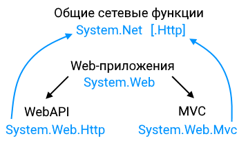
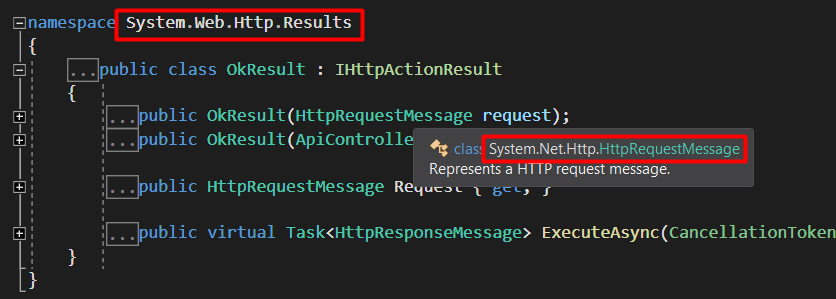
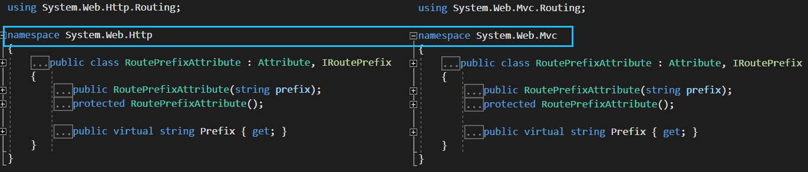
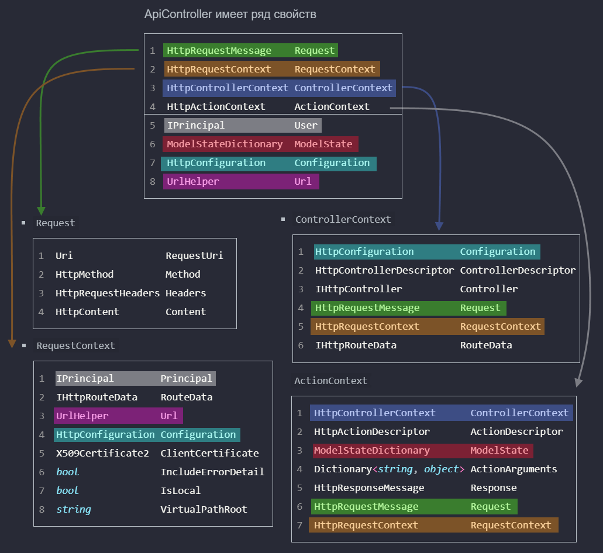
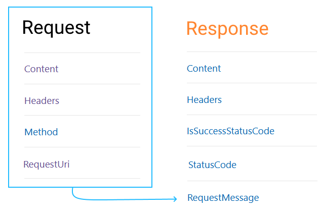

Сорсы здесь https://source.dot.net

# План

* Ответ на запрос
  * Понять, как сгенерировать ответ на запрос
  * Какой это может быть ответ
  * Как прочитать\записать содержимое запроса\ответа

* Принять запрос
  * Как контроллер получает запрос и что этот запрос представляет собой
* Настройка приложения
  * Global.asax

# Задачи

* Понять типичные возможности и сценарии использования типов

  Многие объекты присутствуют сразу в нескольких местах. Например, ControllerContext есть и в самом контроллере, и в свойстве ActionContext контроллера. Казалось бы, какой смысл делать такое дублирование? Поэтому нужно усвоить, какой функционал дает ControllerContext и в тогда будет понятно, где он может понадобиться.

* Возможно, имеет смысл изучать структуру только через сценарии использования.

# Вопросы

* Насколько корректно с концептуальной точки зрения использовать ApiController? Ведь есть ControllerBase. И использовать пространство System.Net в веб-приложении. Ну или хотя бы смешивать System.Web и System.Net


# Резюме

Для контроллеров существуют разные базовые классы, в зависимости от типа приложения.

Результатом работы WebAPI контроллера будет HttpResponseMessage, который можно конечно сформировать вручную, но вообще в контроллерах есть специальные методы для этого.

# Пространства



* System.Net ([msdn](https://docs.microsoft.com/ru-ru/dotnet/api/system.net?view=net-5.0))
* System.Web ([msdn](https://docs.microsoft.com/ru-ru/dotnet/api/system.web?view=net-5.0))

В основе такого разделения лежит принцип, что `.Net` - для группировки сетевых функций общего назначения, которыми могут пользоваться все приложения, в том числе, например, настольные, а `.Web` - для веб-приложений. Соответственно, в пространстве `.Net` и вложенных - нет никаких контроллеров и прочих элементов, характерных для веб-приложений. Но при этом, теоретически, ничто не мешает пользоваться классами из .Net в веб-приложениях, если при этом не возникает конфликтов имен классов. Правда я не знаю, насколько это корректно. Похоже, корректно, потому что даже внутри самого фреймворка классы из .Web пользуются классами из .Net:



Внутри .Web есть разделение на:

* **.Mvc** - MVC приложения
* **.Http** - Web API приложения

Это связано с тем, что в ASP MVC 5 приложения более явно делятся на MVC и на Web API (в ASP Core они уже не разделяются). Помня о таком разделении, проще понимать дальнейшую разницу, например, в контроллерах.

В разных пространствах можно найти классы с одинаковыми именами:



Я не знаю, в чем смысл такого дублирования.

# Контроллеры

В MVC 5 есть три базовых класса контроллеров.

ApiController - используется в приложениях WebAPI.

Controller, ControllerBase - используются в приложениях MVC. Позиционируются вроде как для контроллеров с\без поддержки представлений соответственно. ??? Однако тогда не понятно, какой смысл использовать ControllerBase, если отсутствие поддержки представлений, по сути, превращает контроллер в WebAPI-контроллер, а для таких есть отдельный класс.

## ApiController

ApiController ← Object, `System.Web.Http`

Действия могут возвращать:

* HttpResponseMessage ← Object, `System.Net.Http`
* IHttpActionResult, `System.Web.Http`

IHttpActionResult это интерфейс с единственным методом, который возвращает задачу, типизированную HttpResponseMessage. Так что можно сказать, действия в итоге всегда возвращают HttpResponseMessage, просто в случае с интерфейсом - асинхронно.

В пространстве `System.Web.Http.Results` есть набор классов, которые уже реализуют этот интерфейс, а в контроллерах есть отдельные методы, возвращающие их объекты. Например:

```c#
NotFoundResult NotFound();
OkResult Ok();
OkNegotiatedContentResult<T> Ok<T>(T content);
RedirectResult Redirect(Uri location);
RedirectResult Redirect(string location);
RedirectToRouteResult RedirectToRoute(string routeName, object routeValues);
RedirectToRouteResult RedirectToRoute(string routeName, IDictionary<string, object> routeValues);
ResponseMessageResult ResponseMessage(HttpResponseMessage response);
StatusCodeResult StatusCode(HttpStatusCode status);
UnauthorizedResult Unauthorized(params AuthenticationHeaderValue[] challenges);
UnauthorizedResult Unauthorized(IEnumerable<AuthenticationHeaderValue> challenges);
BadRequestErrorMessageResult BadRequest(string message);
BadRequestResult BadRequest();
ConflictResult Conflict();
ExceptionResult InternalServerError(Exception exception);
InternalServerErrorResult InternalServerError();

JsonResult<T> Json<T>(T content, JsonSerializerSettings serializerSettings, Encoding encoding);
JsonResult<T> Json<T>(T content, JsonSerializerSettings serializerSettings);
JsonResult<T> Json<T>(T content);
InvalidModelStateResult BadRequest(ModelStateDictionary modelState);
FormattedContentResult<T> Content<T>(HttpStatusCode statusCode, T value, MediaTypeFormatter formatter, string mediaType);
NegotiatedContentResult<T> Content<T>(HttpStatusCode statusCode, T value);
FormattedContentResult<T> Content<T>(HttpStatusCode statusCode, T value, MediaTypeFormatter formatter, MediaTypeHeaderValue mediaType);
FormattedContentResult<T> Content<T>(HttpStatusCode statusCode, T value, MediaTypeFormatter formatter);
CreatedNegotiatedContentResult<T> Created<T>(Uri location, T content);
CreatedNegotiatedContentResult<T> Created<T>(string location, T content);
CreatedAtRouteNegotiatedContentResult<T> CreatedAtRoute<T>(string routeName, IDictionary<string, object> routeValues, T content);
CreatedAtRouteNegotiatedContentResult<T> CreatedAtRoute<T>(string routeName, object routeValues, T content);
```


## Controller, ControllerBase

Ололо


# Состав контроллера

ApiController имеет ряд свойств. Некоторые интуитивно понятны, некоторые предстоит изучить.

```c#
HttpRequestMessage    Request
HttpRequestContext    RequestContext
HttpControllerContext ControllerContext
HttpActionContext     ActionContext
    
IPrincipal            User
ModelStateDictionary  ModelState
HttpConfiguration     Configuration
UrlHelper             Url
```

* `Request` - пришедший на контроллер запрос

  ```c#
  Uri                RequestUri
  HttpMethod         Method
  HttpRequestHeaders Headers
  HttpContent        Content
  ```

* `RequestContext` - 

  ```c#
  IPrincipal        Principal
  IHttpRouteData    RouteData
  UrlHelper         Url
  HttpConfiguration Configuration
  X509Certificate2  ClientCertificate
  bool              IncludeErrorDetail
  bool              IsLocal
  string            VirtualPathRoot
  ```

* `ControllerContext` - 

  ```c#
  HttpConfiguration        Configuration
  HttpControllerDescriptor ControllerDescriptor
  IHttpController          Controller
  HttpRequestMessage       Request
  HttpRequestContext       RequestContext
  IHttpRouteData           RouteData
  ```

* `ActionContext` -

  ```c#
  HttpControllerContext      ControllerContext
  HttpActionDescriptor       ActionDescriptor
  ModelStateDictionary       ModelState
  Dictionary<string, object> ActionArguments
  HttpResponseMessage        Response
  HttpRequestMessage         Request
  HttpRequestContext         RequestContext
  ```

  



# HttpResponseMessage

Ответ на веб-запрос. Этот класс присутствует и в фреймворке, и в core, и в новом дотнете.

| Свойство                | Тип                                        |
| ----------------------- | ------------------------------------------ |
| Content                 | HttpContent ← Object                       |
| Headers                 | HttpResponseHeaders ← HttpHeaders ← Object |
| RequestMessage          | HttpRequestMessage ← Object                |
| IsSuccessfullStatusCode | bool                                       |
| StatusCode              | HttpStatusCode ← Enum ← ValueType ← Object |
| TrailingHeaders ???     | HttpResponseHeaders ← HttpHeaders ← Object |


Вписать сюда структуру этого объекта и сделать вывод, как можно в итоге генерировать ответ - чем отличается прямой возврат HRM от Request.Create...

# Классы


* HttpResponseMessage ← Object, System.Net.Http

# Запрос, ответ

```c#
HttpRequestMessage < Object
HttpResponseMessage < Object
HttpContent < Object
HttpContentHeaders < HttpHeaders < Object
HttpMethod < Object
Uri < Object
```

Являются частью фреймворка, а не asp. Почти все находятся в пространстве `System.Net.Http`



Ответ содержит ссылку на запрос. `IsSuccessfullStatusCode` возвращает true, если код находится в пределах 200.

# Контент

https://docs.microsoft.com/ru-ru/dotnet/api/system.net.http.httprequestmessage.content?view=net-5.0#System_Net_Http_HttpRequestMessage_Content

Сюда бы вписать как контент читать\писать

# Результат действия

HttpResponseMessage
IHttpActionResult
Произвольный тип

У контроллера есть свойство `Request` типа


# Контроллеры

Персонажи: ControllerBase, Controller, ApiController


