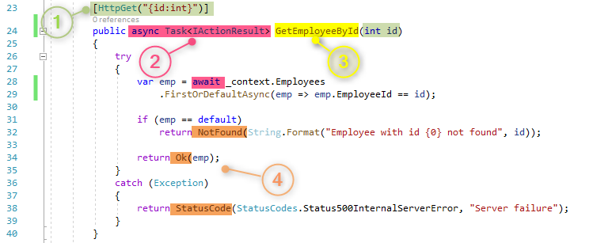
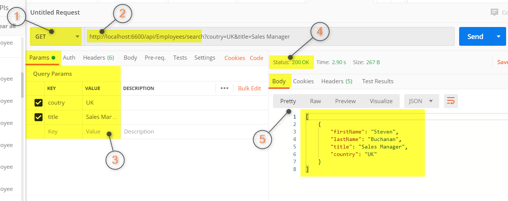

# Контроллеры

Контроллеры можно добавлять даже без скаффолдинга, просто как обычные классы.

Необходимые неймспейсы и за что именно каждый отвечает:


<p align="center">[1]</p>

При объявлении контроллера нужно наследоваться от `Controller` или `ControllerBase`. Первый поддерживает View, а второй — не поддерживает. Поскольку у нас чистый Web API, поддержка View нам не нужна, поэтому наследуемся от `ControllerBase`.

<p align="center">[2]</p>

Атрибут `[ApiController]` дает возможность:

- Автоматически проводить валидацию приходящих объектов, если для их полей заданы атрибуты валидации (пример будет дальше)
- Автоматически сопоставлять находящийся в теле запроса объект с параметром метода (пример будет дальше)

<p align="center">[3]</p>

Атрибут `Route` задает URI, по которому доступен контроллер. Вместо `[controller]` автоматически подставляется имя контроллера. `api` является статичной частью пути.


# Действия



<p align="center">[1]</p>

Методы контроллера, они же действия, снабжаются атрибутами, в зависимости от того, на какой тип запроса должен реагировать метод. Кроме того учитываются параметры, поэтому может быть сколько угодно методов Get, главное чтобы у них различался список параметров.

Параметры указываются в атрибуте и мапятся на параметры метода. Имена должны совпадать. Тип в атрибуте указывать не обязательно.

Путь, по которому доступен метод, формируется из протокола, сервера, Route указанного в атрибуте контроллера, и самого метода. Дальше будет пример на каждый тип запроса, с указанием пути и все прояснится. Например, к этому методу можно получить доступ по адресу `http://localhost:6600/api/Employees/5`

Метод тоже может добавлять к пути статические части, например:

```c#
[HttpGet("search")]
public ...
```

```c#
[HttpGet("id/{id}")]
```

И тогда адрес выглядел бы так: `http://localhost:6600/api/Employees/id/5`

Подробнее на примере метода поиска будет дальше.

<p align="center">[2]</p>

При выполнении действия может использоваться `async\await`, поэтому возвращается `Task`, типизированный `IActionResult`. Можно писать не общий IActionResult, а например `IActionResult<Employee>`, чтобы явно указать тип возвращаемого объекта. Необходимости в явном указании пока не встретил.

Если async\await не нужны, можно просто возвращать любой объект:

```c#
[HttpGet]
public object Get()
{
    return new { Name = "JohNy", Class = "Programmer" };
}
```

<p align="center">[3]</p>

Имя метода не принципиально, потому что контроллер ориентируется на тип запроса и список параметров. Однако лучше задавать осмысленное имя, потому что это поможет при генерации пути к добавленному в POST ресурсу (подробнее позже).

<p align="center">[4]</p>

При возврате ответа принято снабжать его статус-кодом, чтобы клиент по нему мог ориентироваться, что произошло — выполнился ли запрос успешно или нет, и если нет, то почему — ошибка в самом запросе или проблемы на сервере.

Список наиболее популярных статус кодов:


Для наиболее распространенных статус-кодов существуют отдельные методы, как показано в примере: `NotFound`, `Ok`, `BadRequest`. Можно набрать `this.` и полистать доступный список.

Коды, для которых нет отдельного метода, посылаются через специальный метод `StatusCode`, который принимает перечисление `StatusCodes`, содержащее уже полный список существующих кодов.


# Дизайн API

## Примеры

```
[1] http://thefirm.com/api/employees
[2] http://thefirm.com/api/employees/id
[3] http://thefirm.com/api/employees/department
[4] http://thefirm.com/api/employees/department/sex
[5] http://thefirm.com/api/employees/search?department=sales&sex=male
[6] http://thefirm.com/api/burnevidence
```

<p align="center">[1]</p>

Намерение - получить *полный список* сотрудников. Скорее всего конечно вернется только определенная часть, допустим, 50 человек на страницу или какой-то другой алгоритм, потому что сотрудников может быть очень много. Но намерение этого API именно такое - получение сотрудников без какой-либо фильтрации.

```
http://thefirm.com/api/employees
```

<p align="center">[2]</p>

Получить сотрудника по его *уникальному идентификатору*. Здесь это просто цифра с номером сотрудника в БД, но вообще это может быть что угодно - строка или даже какой-то сложный объект.

```
http://thefirm.com/api/employees/5
```

<p align="center">[3]</p>

Получить всех сотрудников, работающих в заданном отделе

```
http://thefirm.com/api/employees/sales
```

```
http://thefirm.com/api/employees/it
```

<p align="center">[4]</p>

Получить всех сотрудников, работающих в заданном отделе и являющихся мужчинами.

Если пример [3] выглядит более-менее, то этот пример уже не очень, потому что слишком углубляется в фильтрацию, а ее лучше делать с помощью Query String, как в [5]

```
http://thefirm.com/api/employees/it/female
```

<p align="center">[5]</p>

Выбрать сотрудников, работающих в отделе продаж и являющихся мужчинами.

Для фильтрации со многими условиями синтаксис Query String походит куда лучше, чем path-стиль. Сюда можно было бы добавить интервал возраста, зарплату и прочее, сформировав большой фильтр:

```
http://thefirm.com/api/employees/search?department=sales&sex=male&minage=20&maxage=40&salaryover=5000
```


## К размышлению

Дизайн API важно разрабатывать так, чтобы было максимально понятно, что происходит. 

Например, использование API `http://thefirm.com/api/employees/id`, выглядит так: `http://thefirm.com/api/employees/5`

Однако, возможно что для восприятия был бы проще такой вариант использования: `http://thefirm.com/api/employees/id/5`. Так наверняка понятно что пятерка относится к id, а не к чему-то еще. В этом случае сам путь тогда изменился бы как-то так: `http://thefirm.com/api/employees/id/id`

Запрограммировать можно как угодно, но здесь я рассматриваю только технический скелет. Хорошие практики составления выходят за пределы этого мануала. Может быть добавлю потом, а может быть это будет уже в другом мануале.


# Реализация

## GET

### Простой

`http://localhost:6600/api/Employees/5`

```c#
[HttpGet("{id:int}")]
public async Task<IActionResult> GetEmployeeById(int id)
{
    try
    {
        var emp = await _context.Employees
            .FirstOrDefaultAsync(emp => emp.EmployeeId == id);

        if (emp == default)
            return NotFound(String.Format("Employee with id {0} not found", id));

        return Ok(emp);
    }
    catch (Exception)
    {
        return StatusCode(StatusCodes.Status500InternalServerError, "Server failure");
    }
}
```

Тип параметра в атрибуте можно и не указывать.

Можно добавить статическую часть:

```c#
[HttpGet("id/{id}")]
```

И обращаться по `http://localhost:6600/api/Employees/id/5`


### С двумя параметрами и больше

`http://localhost:6600/api/Employees/sales/male`

```c#
[HttpGet("{department}/{sex}")]
public async Task<IActionResult> Get(string department, string sex)
{
    try
    {
        var emp = await _context.Employees
            .Where(emp => emp.Department == department && emp.Sex == sex)
            .ToArrayAsync();

        if (emp == default)
            return NotFound(String.Format("Employee with id {0} not found", 1));

        return Ok(emp);
    }
    catch (Exception)
    {
        return StatusCode(StatusCodes.Status500InternalServerError, "Server failure");
    }
}
```

Значение `sales` замэпится на параметр department, а `male` на sex.

Вводить надо сразу оба параметра, потому что они часть пути. Обратиться по `http://localhost:6600/api/Employees/sales` не удастся, даже если задать для sex значение по умолчанию.


### Длинный фильтр

`http://localhost:6600/api/Employees/search?coutry=UK&title=Sales Manager`

Параметров пути нет, есть только статическая часть search. Параметры метода заполнятся из части Query String запроса.

```c#
[HttpGet("search")]
public async Task<IActionResult> GetFiltered(string? firstName, string? lastName, 
                                             string? title, string? country)
{
    try
    {
        var emp = await _context.Employees
            .Where(emp => (firstName != null) ? emp.FirstName == firstName : true)
            .Where(emp => (lastName != null) ? emp.LastName == lastName : true)
            .Where(emp => (title != null) ? emp.Title == title : true)
            .Where(emp => (country != null) ? emp.Country == country : true)
            .Select(emp => new
            {
                firstName = emp.FirstName,
                lastName = emp.LastName,
                title = emp.Title,
                country = emp.Country
            })
            .ToArrayAsync();

        if (!emp.Any())
            return NotFound("No matches found");

        return Ok(emp);
    }
    catch (Exception)
    {
        return StatusCode(StatusCodes.Status500InternalServerError, "Server failue");
    }
}
```

Все параметры имеют nullable-типы, что позволяет при формировании запроса опускать ненужные фильтры. Таким образом, если параметр пришел в запросе, он замапится на параметр метода. Если не пришел - параметр будет null.

### Отправка запроса через Postman



<p align="center">[1]</p>

Выбор типа запроса.

<p align="center">[2]</p>

Основную часть запроса надо ввести вручную.

<p align="center">[3]</p>

Параметры для Query String и их значения заполняются на вкладке Params и добавляются к основной части автоматически. Заодно можно наблюдать, как выглядит правильная строка запроса, если в параметрах есть противные символы вроде пробела и прочие.

<p align="center">[4]</p>

После отправки запроса видно статус ответа.

<p align="center">[5]</p>

Во вкладке Body можно видеть содержимое ответа.


## POST

Чтобы воспользоваться API добавления сотрудника, нужно отправить POST-запрос на адрес `http://localhost:6600/api/Employees`

```c#
[HttpPost]
public async Task<IActionResult> PostEmployee(Employees employee)
{
    try
    {
        await _context.Employees.AddAsync(employee);
        await _context.SaveChangesAsync();

        string path = _linkGenerator.GetPathByAction("GetEmployeeById", "Employees", new { id = employee.EmployeeId });

        return Created(path, employee);
    }
    catch (Exception)
    {
        return StatusCode(StatusCodes.Status500InternalServerError, "Server failue");
    }
}
```

Со статической частью то же самое. Можно написать так:

```c#
[HttpPost("add")]
```

и добавлять по адресу `http://localhost:6600/api/Employees/add`


Объект `employee` берется из тела запроса. Это происходит автоматически, потому что мы указали для контроллера атрибут `ApiController` и получили этот функционал. Иначе надо было бы указать для параметра атрибут `[FromBody]`

```c#
public async Task<IActionResult> PostEmployee([FromBody]Employees employee)
```


При добавлении ресурса принято возвращать путь, по которому этот ресурс доступен, и сам объект. Чтобы не хардкодить путь, используется объект класса `LinkGenerator`. О нем написано отдельно дальше.


### Отправка запроса через Postman


Указывается тип запроса POST и адрес. Сам объект для отправки составляем во вкладке Body, указав raw и JSON.


## PUT

`http://localhost:6600/api/Employees/5`

```c#
[HttpPut("{id}")]
public async Task<IActionResult> PutEmployee(int id, Employees employee)
{
    try
    {
        var emp = await _context.Employees
            .FirstOrDefaultAsync(emp => emp.EmployeeId == id);

        if (emp == null)
            return NotFound(String.Format("No employee with id {0} found", id));

        emp.FirstName = employee.FirstName;
        emp.LastName = employee.LastName;
        emp.City = employee.City;
        _context.Update(emp);
        await _context.SaveChangesAsync();

        return Ok(emp);
    }
    catch (Exception)
    {
        return StatusCode(StatusCodes.Status500InternalServerError, "Server failue");
    }
}
```

Объект для передачи в Postman создается точно так же, как и в POST запросе.

В адресе указываем идентификатор, по которому можно найти объект, подлежащий обновлению.


## DELETE

`http://localhost:6600/api/Employees/5`

```c#
[HttpDelete("{id}")]
public async Task<IActionResult> DeleteEmployee(int id)
{
    try
    {
        var emp = await _context.Employees
            .FirstOrDefaultAsync(emp => emp.EmployeeId == id);

        if (emp == null)
            return NotFound(String.Format("No employee with id {0} found", id));

        _context.Employees.Remove(emp);
        await _context.SaveChangesAsync();

        return Ok("Employee was deleted successfully");
    }
    catch (Exception)
    {
        return StatusCode(StatusCodes.Status500InternalServerError, "Server failue");
    }
}
```
