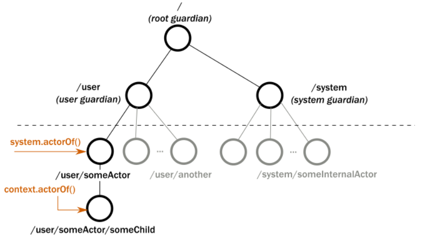

# О чем это и зачем?

Акторная модель позволяет думать о системе в терминах коммуникации между акторами. Акторы - это сущности с состоянием, общающиеся между собой через явную передачу сообщений.

То есть вместо вызова методов, они отсылают асинхронно сообщения. Они сами управляют своим состоянием.

Чем вызвана необходимость использования такой модели? Конкурентным доступом и проблемами из-за Race Condition. Все соблюдения инвариантов объектов актуальны только в пределах потока. При многопоточке приходится лочить критические секции, чтобы не рушить состояние, а локи при большом количестве потоков становятся неэффективными, потому что потоки блокируются вместо того чтобы работать, плюс вырастает риск dead-локов. Плюс локи наиболее эффективны только локально, в распределенных системах - нет.

В 80-90х годах концептуально считалось, что процессоры пишут данные прямо в память. Но современные CPU пишут напрямую толькло в кэш, который у каждого ядра свой. Поэтому, чтобы сделать эти данные видимыми для другого ядра и его потока, нужно их перенести из одного кэша в другой. То есть концепция "общей памяти" как таковая уже не существует. Передача данных между ядрами больше похожа на обмен данными между компьютерами в сети. И поэтому лучше утилизировать эту идею обмена сообщениями, чем костылить блокировки. Есть сущность, участвующая в конкурентной работе, у нее есть состояние, которое меняется явными посылами сообщений - это логичнее ложится на современную реальность нагруженных систем.

Отличие между вызовами методов и посылом сообщений в том, что при вызове метода колер ждет ответа и не может работать дальше, пока его не получит. В случае посыла сообщения, он не ждет. Вероятно, просто переходит в какое-то состояние ожидания ответного сообщения, но это не одно и то же. И важно то, что каждый актор обрабатывает одно сообщение за раз, за счет чего не возникает разрушение состояния, ведь сообщения обрабатываются по очереди. И в зависимости от количества ядер, одновременно могут работать несколько акторов над своими сообщениями, так что конкурентность не приносит проблем.

## Состав актора

Актор - это "крайняя форма ООП" в том смысле, что актор не только инкапсулирует свое состояние, но и выполнение - никто не может "вызвать метод" на акторе, а только "попросить" его что-то сделать, послав сообщение.

Актор имеет:
1) Почтовый ящик - очередь сообщений
2) Сообщения - набор данных, олицетворяющих собой некое действие, метод, с параметрами вызова (например, объект AddBehavior с полем value. Другой актор будет знать, что если пришел объект типа AddBehavior, то нужно прибавить значение из его поля value куда-нибудь себе). В общем, то что актор хочет заставить делать других насколько я понял.
3) Поведения - написано "the state of the actor, internal variables etc.". Но мне кажется что это именно этот самый набор реакций на сообщения, а состояние тут вообще используется в другом значении - например "ожидаю результата от актора D".
4) Окружение исполнения - механизм, выбирающий акторов, у которых есть сообщения, и запускающий их в работу. Управляет пулом потоков.
5) Адрес - пока неизвестно.

В общем, за счет того, что "сделай вот это" отделено от момента, когда "это" реально начнет выполняться, сама собой отпадает проблема блокирования потока. "Заблокироваться" может актор, пока не получит нужные ему данные, ну а поток просто возьмет в обработку другого актора.

## Стратегии доставки

* **At-most-once delivery**

  > means that for each message handed to the mechanism, that message is delivered zero or one time; in more casual terms it means that messages may be lost, but never duplicated.

  Доставка без гарантий. Сообщение может прийти 0 или 1 раз. Дублей не будет, но сообщение вообще может не дойти. Самый дешевый по ресурсам вариант.

* **At-least-once delivery**

  > means that for each message handed to the mechanism potentially multiple attempts are made at delivering it, such that at least one succeeds; again, in more casual terms this means that messages may be duplicated but not lost.

  Здесь не понятно. Разве несколько попыток гарантируют доставку? Имхо нет. И что значит "дубли"? Дубли попыток или одно и то же сообщение придет получателю несколько раз? Тогда это шляпа какая-то.

* **Exactly-once delivery**

  > means that for each message handed to the mechanism exactly one delivery is made to the recipient; the message can neither be lost nor duplicated.

  Одна отправка - одна доставка. Опять же, как это уберечь от потерь?

В общем случае, Akka перекладывает решение, что считать успешной доставкой, на программиста. Потому что успех или провал имеет смысл только в домене. Сам факт какой-то доставки сообщения ничего не значит, потому что данные, получаемые в результате обработки сообщения например могут быть невалидными.

## Последовательность сообщений

Потом

## Ошибки

Всего есть два вида ошибок:

* Доменная ошибка - например, не найден пользователь с указанным ID. То есть операция отработала успешно, просто результат в рамках бизнес-логики означает ошибку.
* Реальная ошибка - когда сама операция проваливается по какой-то технической причине и актор "отваливается".

Первый вид ошибок вообще и не является ошибкой с точки зрения системы ошибкой. Просто актор отправляет обычное сообщение с результатом. Просто результат - ошибка.

На второй случай - у каждого актора есть родитель, который называется ***супервизор*** и если дочерний актор отваливается, супервизор об этом узнает и реагирует на это. Он может его например перезапустить, остановить. В общем, об этом будет наверное дальше написано. Суть в общем в том, что для всей системы такое "падение" актора может даже не быть заметным.

## Организация акторов

Актор может быть создан только из другого актора. Таким образом, все акторы организованы в дерево, и каждый актор имеет родителя.

В Akka акторы разделены на две области - *системную* и *пользовательскую*. В первой работают служебные акковские акторы, а во второй - все акторы, создаваемые нами - пользователями библиотеки.

Для нас есть вызов `System.ActorOf()`, который создает актора верхнего уровня и пристраивает его к пользовательской ветке. Под верхним уровнем подразумевается "пользовательский верхний уровень", потому что как видно из рисунка, создаваемые нами акторы отнюдь не находятся наверху всего дерева.

* IActorRef У каждого актора есть "ссылка" вида `akka://testSystem/user/first-actor/second-actor#-1544706041`. Акторы могут взаимодействовать по сети, поэтому такая ссылка является полноценным URI. Часть /user... в принципе понятна, это пользовательская область, а дальше структура акторов. В конце идет уникальный идентификатор. Первая часть ссылки пока не понятно, потом наверное покажут. Поскольку обещают прозрачное общение акторов в разных системах сети, наверное тут может быть протокол, адрес, хз.

* У акторов есть жизненный цикл. Остановить актора можно через `Context.Stop(IActorRef)`. Принято останавливать самого себя, то есть когда актор получает какое-то сообщение, он должен остановить самого себя, а не другой актор. При этом все дочерние акторы тоже останавливаются, что удобно для освобождения ресурсов. У акторов есть разные методы жизненного цикла, вроде `PreStart()`, `PostStop()`, `PreRestart()`, `PostRestart()`
* Когда актор выбрасывает исключение или возникает необработанное исключение, оно всплывает вверх по дереву до родителя, а актор временно приостанавливается. Дефолтной *стратегией* обработки является остановка дочернего актора и сразу же запуск снова.