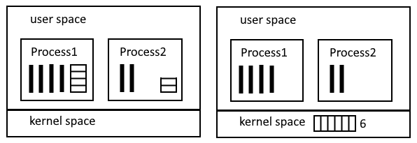
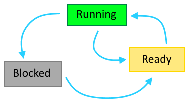

# Связанные понятия

Многозадачность

> Это способность системы переключаться между процессами туда-сюда, за счет чего возникает иллюзия их одновременной работы, потому что переключения происходят быстро.

kernel space (KS) и user space (US)

> Память условно можно разделить на две области - в одну область загружается ядро (KS), а в другую область (US) загружаются все остальные программы, называемые "пользовательскими", хотя реальный пользователь о них может даже не знать, просто они так называются. Все, что не ядро - "пользовательские" программы. Они не имеют доступа к KS. Ядро же к US доступ имеет.

Прерывания, вектор прерываний

> ???

Системные вызовы

> ???

Счетчик команд, программный счетчик

> ???

Указатель стека

> ???

Критическая секция (КС)

> Участок кода, в котором фигурирует общая переменная (или любой другой ресурс), которую могут совместно использовать несколько потоков. Например, есть статическая переменная и функция, которая ее увеличивает на единицу. Если запустить такую функцию на исполнение сразу в нескольких потоках, то без организации синхронизации между ними результаты прибавления периодически могут теряться. Строчка функции, в которой выполняется прибавление - и есть критическая секция.

Активное ожидание

> Оно же Busy Wainting. Это когда ожидание входа в критическую секцию реализуется через цикл, который крутится пока не нарушится условие. В противовес этому способу есть усыпление и пробуждение процессов\потоков. У обоих подходов есть свою достоинства и недостатки.

Примитивы синхронизации

> Это базовые средства для организации синхронизации работы нескольких потоков. Обычно имеют системную\аппаратную поддержку. К ПС относятся семафоры, мьютексы, фьютексы, мониторы.

# Общие вопросы

- [x] Имеет ли смысл процесс без потоков? Или в процессе всегда как минимум один поток?

> Процесс без потока смысла не имеет, поскольку процесс - просто "контейнер" с некоторой служебной информацией, в котором всегда как минимум один поток, который и производит всю работу.

- [x] Что для ОС есть процесс, а что - поток? Как эти вещи организованы технически?

> Для ОС что поток, что процесс технически - просто массив со структурами, размещенный в оперативной памяти, из которых понятно, какое адресное пространство занимает процесс, какой у него ID, приоритет и прочая служебная информация. Где именно они расположены - зависит от конкретной модели реализации в системе.
>
> Логически процесс ассоциируется с запущенной программой, а потоки - с "подзадачами" внутри этой программы, которые могут выполняться "одновременно". Но опять же, техническая реализация может делать грань между процессами и потоками весьма тонкой.

- [x] Как идет обмен данными между потоками и процессами?

> Современные ОС позволяют процессам шарить часть своего адресного пространства как раз для возможности обмена между процессами. А между потоками обмен проще, потому что если они принадлежат одному процессу, то имеют одинаковый доступ к его адресному пространству. Это на бумаге. На практике нужно уже смотреть то, какие средства коммуникации дает конкретная система.

- [x] Что такое контекст применительно к потокам и процессам?

> Контекст - это вся совокупность информации, связанная с выполнением потока\процесса. Сюда входят как вещи, необходимые для приостановки\возобновления работы процесса\потока вроде счетчика команд, указателя стека, содержимое регистров CPU, так и что-либо другое.

- [x] Вроде контекст - это не только состояние памяти, но и регистров CPU. Как сохраняется это все при переключении? И как загружается обратно.

> Когда приходит время приостановить процесс\поток, берутся текущие значения из регистров CPU и сохраняются в адресное пространство процесса\потока. Кто именно этим занимается - ядро или пользовательская программа, опять же, зависит от реализации потоков\процессов в системе.

- [x] Переключается ли CPU между потоками?

> Да, переключается. Вопрос только в том, что переключение реализуется по-разному. Если потоки реализованы целиком в пространстве пользователя, тогда они сами должны передавать управление над CPU своим "товарищам по процессу". Если же они реализованы целиком в пространстве ядра, тогда переключение происходит по таймеру CPU и при участии ядра, так же как и при переключении между процессами.

- [ ] Что такое виртуальная память?
- [x] Какие классические проблемы связаны с потоками?

> Как с потоками, так и с процессами основная проблема - Race Condition, когда процесс\поток не успевают доделать логически единую операцию над общим ресурсом и прерываются, а при возобновлении работы оказывается, что предыдущее значение общего ресурса уже неактуально. Соответственно, дальше работа ведется с заведомо некорректными исходными данными и результат тоже получается некорректный.

- [ ] Могут ли два процесса, выполняющиеся на разных ядрах, одновременно писать и читать в одно и то же место на диске или в памяти? Это физически вообще возможно?
- [ ] Что такое POSIX-совместимая операционная система?
- [ ] Что такое блокирующий системный вызов? Все ли системные вызовы являются блокирующими?
- [ ] Проще ли потоку, реализованному в US, сделать системный вызов, чем потоку, реализованному в KS?

# Процессы и потоки

Процесс - это абстракция запущенной программы. Каждую программу ОС запускает в виде отдельного процесса, даже если это одна и та же программа. Каждый процесс имеет свое собственное адресное пространство - персональную область памяти, выделенную ему операционной системой в US.

Классически процесс представляется в виде "контейнера" для потоков и содержит как минимум один поток.

> - [ ] В Linux потоки и процесс представляют собой по сути одно и то же. Что это значит?

То есть работу выполняет именно поток. Процесс без потока не имеет смысла.

У ОС есть таблица процессов - массив структур, в которых перечислена разная информация, относящаяся к процессу и его работе. Например, ID, приоритет, состояние процесса и другая. Используя ее, ОС может остановить процесс, а потом возобновить и продолжить работу с того же места, как будто он и не прерывался.

Аналогичная таблица существует и для потоков. У каждого потока тоже есть ID, состояние и прочее.

> - [ ] Поскольку именно потоки выполняют работу, то логично предположить, что значения, помещенные в процессе работы в регистры CPU, а также счетчик команд, хранятся именно для потока, а не для процесса. Так ли это?

> - [ ] Есть ли у потока свое адресное пространство внутри АП процесса?

# Создание и завершение процессов

Создаться процесс может только по "приглашению" уже работающего процесса, который посылает ОС соответствующий системный вызов. В разных ОС это реализовано по-разному. Допустим, в Unix есть процесс `init()` - инициализации операционной системы. Он создает все другие нужные для функционирования ОС процессы с помощью системного вызова `fork()`. Последовательность можно загуглить отдельно, но для примера предположим, он создает несколько процессов терминалов, функционал которых - ожидать ввода логина и пароля пользователя. Когда эти данные получены, процесс терминала создает процесс логина, который проверяет корректность данных. Если все в порядке, процесс логина создает процесс шелла, куда пользователь может уже вводить команды. Процесс шелла создает процессы под эти команды. То есть всегда идет эта цепочка - уже созданный процесс может вызвать создание другого процесса.

Завершиться процесс может по нескольким причинам:

* Естественные - процесс просто выполнил все свои команды и завершился. Завершение означает уничтожение процесса.
* Принудительные - если другой процесс посылает команду завершения указанного процесса (kill в Unix).
* Ошибка - ошибки внутри процесса могут обрабатываться по-разному. Один из вариантов - завершение.

# Связь между процессами

> - [ ] Как родительские и дочерние процессы связаны? В чем заключается эта связь?

Например в Unix есть понятие *иерархии процессов*. То есть порожденный процесс всегда будет связан с родительским и например сигнал с клавиатуры, полученный родительским процессом, провалится и во все дочерние, что бы это ни значило. В Win там по-другому. Есть какой-то токен, который вроде можно передать другому процессу, что правда это значит, я не знаю.

Но у Unix и Win есть общая характеристика - при уничтожении родительского процесса, дочерние не завершаются.

> - [ ] Если выйти из процесса терминала в Unix, будут ли все запущенные пользовательские процессы продолжать выполняться ?

# Способы реализация потоков

Потоки можно реализовать тремя способами - в KS, в US, и гибридно. Технически это будет влиять на то, где будет располагаться таблица потоков - в адресном пространстве ядра или в адресном пространстве процесса.



> - [ ] У каждого способа есть достоинства и недостатки. В частности, связанные с обработкой системных вызовов. В чем они заключаются?

Как процессы, так и потоки работают по очереди, между ними постоянно происходит переключение. Как оно происходит - зависит от реализации. Вообще, переключение между процессами происходит по таймеру. Когда ядро выбрало процесс, которому передать контроль над CPU, оно сперва устанавливает CPU-таймер, чтобы определить квант времени, положенный процессу, и только потом отдает процессу управление. Когда таймер щелкает, управление снова возвращается ядру.

В случае с потоками дело обстоит иначе (если они реализованы в US. Если же в KS, то вероятно их тоже перелючает ядро). Так вот, если потоки реализованы в US, то к переключению между ними ядро отношения не имеет, потому что оно даже ничего про них не знает. Эта задача ложится на сам процесс, содержащий эти потоки, и на какую-нибудь пользовательскую библиотеку.

> - [ ] Какой способ реализации потоков используется в Linux и Windows?


# Состояние процесса

Для потоков состояния такие же + дополнительное "завершен"



1. Running - процесс выполняется прямо сейчас, ему выделено процессорное время
2. Ready - процесс готов к выполнению, у него есть все необходимое для выполнения, он никого не ожидает, так что готов выполняться, как только ему дадут процессор
3. Blocked - процесс не может выполняться, потому что чего-то ожидает. Например, IO операции или завершения другого процесса

Объяснение именно такой диаграммы состояний: между Running и Ready процессы переходят потому что у них заканчивается квант процессорного времени. То есть процесс бы и не прерывался, но надо дать поработать другим. Из blocked нельзя сразу перейти в running, потому что у процессов есть приоритеты и заблокированный процесс может иметь низкий приоритет, а значит не может выполняться вперед процесса с высоким приоритетом. Поэтому если blocked процесс вдруг становится готов к выполнению, то переходит именно в ready ко всем остальным готовым, а дальше уже планировщик выбирает из них более приоритетный и выделяет ему процессорное время.

> - [ ] Как процесс выйдет из blocked? Ведь кто-то должен ему сообщить о том, что операция, которую он ждет, завершена. Как это организовано?

У каждого потока собственный стек.

# Стандартизация процессов

Работа процессов в некотором роде стандартизирована. Есть понятие POSIX-совместимая ОС. В C есть пакет `<pthread.h>`

> - [ ] Значит ли это, что каждая такая ОС должно предоставлять примерно похожий функционал по работе с потоками? Не ограничивает ли это разработчиков в возможности реализовывать какой-то уникальный функционал по организации работы потоков?

# IPC

Interprocess Communitcation - межпроцессное взаимодействие.

IPC поднимает три вопроса:

* Как организовать обмен данными между процессами
* Как организовать одновременный доступ к одним и тем же данными
* Организация правильной последовательности процессов, которые зависят друг от друга

Процессы могут шарить часть своего адресного пространства, чтобы обмениваться информацией с другими процессами.

# Race Condition

Это проблема, возникающая при доступе разных потоков к общим данным. Допустим, есть целочисленная переменная, в которую один процесс A прибавляет 1, а второй B - 2. Поскольку операция присваивания делится как минимум на три операции - считать исходное значение, прибавить и записать результат, то может возникнуть такая ситуация:

* Процесс A считывает значение переменной. Пусть это число 7
* В этот момент у него заканчивается квант времени и начинает работу процесс B
* B тоже считывает 7, делает +2 и записывает в результат 9
* Процесс А возобновляет свою работу с того места, где закончил в прошлый раз: прибавляет 1, но к 7, потому что именно 7 он считал себе в прошлый раз, и записывает в результат 8, хотя должно быть 10

Это и есть Race Condition, возникает, когда процесс не успевает доделать свою работу над ресурсом, которым пользуется кто-то еще помимо него. И в итоге какие-то результаты теряются.

Таким образом, когда больше одного процесса входят в свои критические секции, возникают проблемы.

Есть 4 условия, которые должно соблюдать решение, призванное избежать RC, и при этом считаться хорошим:

1. Два потока не могут одновременно находиться в своих КС
2. Поток, не находящийся в своей КС, не должен блокировать другие потоки
3. Поток не должен вечно ждать своей очереди входа в свою КС
4. Нельзя ориентироваться на скорость CPU или количество CPU

# Способы избежания Race Condition

## Отключить прерывания

Первый вариант решения проблемы RC - отключение прерываний. Причина RC - прерывание от таймера, которое может остановить процесс в неподходящий момент. Соответственно, если дать возможность процессу отключить прерывания перед входом в КС и включить их обратно при выходе из нее, его не прервут в неподходящий момент и проблемы не будет. Но это, во-первых, опасно, потому что он может не включить прерывания обратно, а, во-вторых, неактуально для многоядерных CPU, потому что прерывания отключаются только для того ядра\CPU, на котором выполняется процесс. Соответственно, если какой-то другой процесс, выполняющийся на другом ядре, работает с общим ресурсом, проблема опять появляется.

## Locking Variable

Второй способ - "Locking Variable" заключается в заведении специальной переменной-флага (лок), которую процессы будут устанавливать в 1 при входе в КС и возвращать в 0 при выходе из нее. Тогда другой процесс перед входом в КС смог бы проверять лок и понимать, можно ли ему входить в КС или нельзя. Но это решение само страдает от RC. То есть процесс может считать значение лока, тут у него заканчивается квант и он не успевает проанализировать считанное значение. Когда ему в следующий раз перейдет управление, он начнет с анализа, но считанное в прошлый раз значение может быть уже неактуальным. Если попытаться считать повторно, снова может возникнуть прерывание процесса и так далее. То есть ситуация неразрешимая без аппаратной поддержки (TSL, об этом далее).

> - [ ] Действительно ли ядро может допустить ситуацию, что процесс с низким приоритетом никогда не получит процессорное время, даже если есть процессы с высоким приоритетом?

## Строгое чередование

Это способ, при котором процессы явно указывают, какому другому процессу передать управление. Это тоже делается через общую переменную, но за счет того, что каждый процесс ожидает своего уникального значения, одновременного вхождения в КС не бывает:

```c
#define TRUE 1;
int turn = 0;
// Процесс 1
while (TRUE)
{
    while (turn != 0);
    do_crit();
    turn = 1;
    do_non_crit();
}
// Процесс 2
while (TRUE)
{
    while (turn != 1);
    do_crit();
    turn = 0;
    do_non_crit();
}
```

При такой организации процесс не сможет войти в КС, если не его очередь. Однако может получиться следующая ситуация: если П1 (или П2, не важно) выполняется очень быстро и за отведенный ему квант времени успеет полностью выполнить свой главный цикл, то на вторую "итерацию" уже зайти не сможет, потому что уже перезаписал turn, и повиснет на весь оставшийся квант в цикле, хотя теоретически мог бы успеть сделать 2 итерации или даже больше. Это нарушает принцип "процесс не может вызывать блокировку, если не находится в КС". Так что такой алгоритм может нормально работать только если все процессы выполняются примерно одинаковое время.

## Алгоритм Петерсона

Этот алгоритм тоже использует активное ожидание, но не имеет недостатка в виде самоблокирования:

```c
#define TRUE  1
#define FALSE 0
#define N     2

int turn;
int interested[N];

void enter_CR(int process)
{
    int other = 1 - process;
    interested[process] = TRUE;
    turn = process;
    while(turn == process && interested[other] == TRUE);
}

void leave_CR(int process)
{
    interested[process] = FALSE;
}
```

Смысл в том, что вводится две специальные функции, одну из которых процесс должен запускать непосредственно перед входом в КС, а вторую - сразу же после выхода из КС. Есть массив с номерами процессов, заинтересованных во входе в КС, и переменная, чтобы "застолбить" себе вход.

За счет использования двух переменных, не может получиться ситуации, что два процесса разом окажутся в КС. В общем-то это можно представить и без объяснений, посмотрев на код. Но все равно приведу некоторые из возможных вариантов:

1. Процесс П0 вызывает enter_CR(0). Отмечается в массиве заинтересованных. Например, на этом моменте квант заканчивается и другой процесс, П1, вызывает enter_CR(1) и доходит до while. Оба условия выполняются и П1 начинает активное ожидание. Управление возвращается П0. Он продолжает со строчки turn = process, и перезаписывает turn в 0. Доходит до цикла и тоже начинает активное ожидание. Когда квант заканчивается и управление снова попадает П1, тогда условие while нарушается, потому что turn уже = 0, а не 1, функция завершается и П1 попадает в КС.
2. Процесс П0 вызывает enter_CR(0). Отмечается в массиве заинтересованных. Присваивает turn. Если заинтересованных больше нет, он входит в КС. Если есть, начинается активное ожидание. Дальше все как в первом варианте. Как только другой процесс сменит turn и управление вернется на П0, цикл ожидания прервется и он войдет в КС.

Таким образом получается, что кто первым присвоит turn, тот первым и попадет в КС. Хотя при наличии других заинтересованных конечно выглядит немного странно - для попадания в КС приходится ожидать, пока другой процесс перезапишет turn. Но тем не менее это работает как минимум для двух процессов.

> - [ ] С виду этот алгоритм расчитан только на 2 процесса, как минимум, именно такая реализация. Потому что если N будет 3, то вычисление other в таком виде перестанет работать. Можно ли адаптировать этот алгоритм для нескольких процессов?

## Команды TSL и XCHG

Проблема с "Locking Variable" возникает из-за того, что цепочка "считать-проанализировать-записать" должна выполняться разом, "атомарно". Но без аппаратной поддержки это невозможно. Поэтому в ОС есть специальные команды TSL и XCHG, которые эту аппаратную поддержку обеспечивают. TSL - "Test and Set Lock" выглядит примерно так:

```assembly
TSL REGISTER, LOCK  | Считать значение LOCK в регистр, а в LOCK записать 1
```

Аппаратная поддержка заключается в том, что в момент выполнения команды TSL процессор блокирует шину памяти и поэтому никакой другой процессор (или ядро процессора) не может ничего записать в переменную LOCK. Поскольку это блокирование осуществляется на очень короткое время, оно не оказывает сильного влияния на производительность. Таким образом, после выполнения команды TSL, в переменной LOCK оказывается 1, а ее старое значение оказывается в регистре.

Теперь можно удобно реализовать функции входа и выхода из критических секций:

```assembly
enter_region:
    TSL REGISTER, LOCK
    CMP REGISTER, #0
    JNE enter_region
    
    RET
    
leave_region:
    MOVE LOCK, #0
    RET
```

Как могут развиваться события:

1. Процесс П1 заходит в enter region, выполняет TSL. Допустим, в LOCK был 0. Тогда этот 0 оказывается в регистре, а в LOCK записывается 1. Тут заканчивается квант и управление достается процессу П2. При этом важно помнить, что перед передачей управления П2, значения регистров для П1 сохраняются, чтобы можно было восстановить его работу в будущем.

2. П2 тоже заходит в enter region, выполняет TSL. В регистр из LOCK считывается 1, и в LOCK снова записывается 1. На строчке #3 становится понятно, что в LOCK была 1, поэтому управление снова попадает на строчку #2. Опять в регистр считывается значение LOCK, которое по-прежнему 1, опять проводится проверка и осуществляется переход. То есть получается активное ожидание.

3. Когда управление возвращается к П1, значения его регистров восстанавливается. В пункте 1 мы сказали, что в LOCK изначально был 0. Таким образом, строчка #3 даст true и осуществится возврат из функции, строчка #6. П1 выполнит свою КС, вызовет функцию leave region, которая поместит в LOCK 0. И когда управление вернется П2 и он снова окажется на строчке #2 с TSL, то в регистр попадет 0, а в LOCK запишется 1. Теперь уже строчка #3 для П2 даст true и он сможет войти в КС.

## Усыпление и пробуждение

У команды TSL и алгоритма Петерсона есть недостаток, связанный с тем, что освобождение лока они ожидают через busy waiting. Недостаток в том, что если процесс A с более высоким приоритетом переходит в состояние blocked, а потом процесс B с низким приоритетом входит в КС и занимает лок, то когда процесс А возобновит работу и войдет в цикл ожидания освобождения лока, на этом дело и закончится, потому что процесс В никогда не получит процессорное время из-за своего низкого приоритета, а значит не сможет освободить лок и следовательно процесс А не выйдет из цикла ожидания.

Кроме того, активное ожидание подразумевает то, что процессорное время по сути тратится впустую на прокрутку цикла, и никаких полезных вычислений в это время не производится. Это иногда может быть выгодно, если такое ожидание длится недолго и тогда дешевле получается покрутить цикл, чем переключать контексты процессов. Но не всегда.

Поэтому существует другой способ ожидания, основанный на использовании системных вызовов, которые ***усыпляют*** и ***пробуждают*** процессы. Условно назовем их `sleep` и `wakeup`.

## Проблема поставщика и потребителя

Представим ситуацию, что есть некоторый буфер сообщений и два потока - "поставщик" наполняет этот буфер, а "потребитель" извлекает. Если буфер полностью заполняется, поставщик должен приостановиться и возобновить работу, когда в буфере снова появится хотя бы один слот. Потребитель, аналогично, должен остановиться, когда в буфере нет ни одного сообщения, и восстановиться, когда появится хотя бы одно. Каждый поток, обнаруживая условие остановки, делает системный вызов sleep и таким образом переходит в состояние blocked. Противоположный поток, обнаруживая условие пробуждения, делает вызов wakeup, пробуждая своего "коллегу".

> - [ ] Действительно ли sleep и wakeup являются системными вызовами, а не пользовательскими функциями?

Здесь опять может возникнуть проблема из-за RC. Например, размер буфера 10. Поставщик прочитал заполненность буфера и она оказалась равной 10. В этот момент его квант времени закончился, и он не успел заснуть. Потребитель прочитал сообщение и понял, что буфер был 10, а стал 9, значит пока разбудить поставщика и посылает команду wakeup. Но поскольку поставщик еще не спит, то команда не имеет никакого эффекта. Как только поставщик продолжает работу, он анализирует ранее прочитанное сообщение, видит 10 и засыпает. Потребитель продолжает читать сообщения, доходит до 0 и тоже засыпает. Оба потока благополучно уснули.

Пример кода, который демонстрирует решение задачи через sleep и wakeup и описанную проблему:

```c
#define TRUE 1
#define N 100
int count = 0;

void producer()
{
    int item;
    int prev_count;
    
    while (TRUE)
    {
        item = create_item();
        if (count == N) sleep();
        insert_item(item);
        prev_count = count;  // Моя доработка
        count++;
        if (count == 1 && prev_count == 0) wakeup(proc_consumer);
    }
}

void consumer()
{
    int item;
    int prev_count;
    
    while (TRUE)
    {
        if (count == 0) sleep();
        item = get_item();
        prev_count = count;  // Моя доработка
        count--;
        if (count == N - 1 && prev_count == N) wakeup(proc_producer);
        do_some_with_item(item);
    }
}
```

Решение может заключаться в введении ***бита активации*** - специального флага, который при поступлении wakeup устанавливается в 1. Тогда предварительно посмотрев на этот бит поставщик мог бы понять, что ему не нужно засыпать.

# Примитивы синхронизации

## Семафоры

Семафор - это примитив синхронизации, представляющий собой счетчик. Работа с ним основана  на использовании процессами двух *атомарных операций* - `up` и `down`, которые соответственно увеличивают и уменьшают семафор на единицу. Когда операция down применяется к семафору, который уже равен 0, то она не завершается, а вызвавший ее процесс засыпает.

Счетчик реализован в виде глобальной переменной или иным способом так, чтобы он был доступен нескольким процессам.

С помощью семафоров можно организовать как охрану входа в критическую секцию, так и анализировать какие-нибудь другие моменты. Будет показано дальше на примере решения задачи "Поставщика и потребителя".

> - [ ] Кто занимается пробуждением спящих процессов? В ядре есть какой-то функционал, который связывает спящие процессы с неким семафором и их будит ядро?
>
> 

> - [x] Может ли семафор иметь значение больше 1? Судя по разным описаниям с хабра, вроде может. Вроде как он может быть например 3 и тогда три процесса, обратившись к семафору, получат "зеленый свет" на выполнение. Но это как-то абсурдно, ведь задача семафора вроде как блокировать одновременный вход нескольких процессов в КС.
>
> Дело в том, что семафор может использоваться *не только* для предотвращения одновременного вхождения нескольких процессов в КС, но и для некоторой синхронизации. На примере задачи поставщика и потребителя семафоры позволяют благодаря анализу свободных и занятых слотов усыплять и пробуждать процессы, заполняющие и читающие буфер. Соответственно, значение семафора будет 100, если в буфере 100 слотов.
>
> Суть в том, что как только значение семафора становится 0 и какой-то процесс пытается выполнить на нем операцию down, то эта операция не завершается и процесс засыпает. А как только семафор станет >0, то ядро выберет какой-нибудь процесс из тех, которые заснули на этом семафоре, этот процесс продолжит работу, завершит не законченную в прошлый раз операцию down, и войдет в КС.
>
> Если от семафора не требуется синхронизация, а только охрана КС, тогда действительно у него будут значения только 0 и 1. И такой "семафор" уже называется мьютекс.

> - [x] Может ли процесс\поток, находясь в КС, прерваться?
>
> Да, может. КС ничем не отличается от любой другой части кода за исключением того, что перед ней и после нее используются операции охраны КС. Соответственно, она может прерваться, при этом другие потоки просто все еще не смогут войти в КС, пока уже вошедший в нее поток снова не вернется к работе, не выйдет из КС и не выполнит, например, сброс мьютекса.

> - [x] Один семафор объединяет процессы, работающие с одним и тем же общим ресурсом?
>
> Разумеется. На каждую КС используется свой семафор.

## Мьютексы

Мьютекс - это семафор, который может иметь значения только 0 и 1. Ввиду этого используется обычно только для охраны входа в КС. Вот пример реализации мьютекса:

```assembly
mutex_lock:
    TSL REGISTER, MUTEX
    CMP REGISTER, #0
    JZE ok
    
    CALL thread_yield
    JMP mutex_lock
ok:
    RET
    
mutex_unlock:
    MOVE MUTEX, #0
    RET
```

Эти функции похожи на рассмотренные ранее в разделе про команду TSL. Но здесь отличие в том, что вместо активного ожидания используется команда thread_yield, которая усыпляет текущий поток.

## Решение задачи "Поставщика и Потребителя"

Пример решения задачи с использованием семафоров и мьютексов:

```c
#define TRUE 1
#define CAPACITY 100
int sem_busy = 0;  // Занятые слоты
int sem_free = CAPACITY;  // Свободные слоты
int mut_CR = 1;

void producer()
{
    int item;
    
    while (TRUE)
    {
        item = create_item();
        down(sem_free);
        down(mut_CR);
        insert_item(item);
        up(mut_CR);
        up(sem_busy);
    }
}

void consumer()
{
    int item;
    
    while (TRUE)
    {
        down(sem_busy);
        down(mut_CR);
        item = get_item();
        up(mut_CR);
        up(sem_free);
    }
}
```

Мьютекс здесь используется для охраны КС. Каждый раз, как только один из процессов заходит в КС, мьютекс становится 0 и никто другой зайти в КС не может, пока процесс не апнет мьютекс обратно. Семафоры используются для синхронизации помещения и извлечения элементов. Когда семафор  `sem_free` станет 0 (это означает, что свободных мест в буфере нет), то поставщик заснет, когда попробует применить к нему down. Когда потребитель вытащит элемент из буфера, он апнет sem_free и тогда поставщик проснется.

Потребитель может работать быстрее поставщика и за свой квант освободить много слотов. Поэтому он также использует down на семафоре `sem_busy`, чтобы случайно не начать забирать то, чего еще нет. То же самое справедливо и в обратную сторону. Поставщик может работать быстрее потребителя. Поэтому оба процесса используют сразу два семафора.

## Фьютексы

Фьютексы (от fast userspace mutex)

Это примитив синхронизации, который для реализации своей работы комбинирует работу с ядром и с пользовательской библиотекой. На пользовательскую библиотеку возлагается обязанность выполнять down и если оказывается, что блокировка уже есть, то усыплять процесс и помещать его в очередь, расположенную в kernelspace. Если блокировки нет, то down завершается без привлечения ядра. За счет того, что обращение к ядру происходит не каждый раз, а только когда это действительно нужно, фьютексы работают быстрее.

## Некоторые итоги и вопросы

Когда потоки реализуются в US, то их управлением ядро не занимается. Оно о них даже ничего не знает и управление целиком ложится на пользовательские библиотеки. Если в случае с процессами переключение осуществляется за счет CPU-таймера, то US-потоки сами должны отдавать процессор своим братишкам, принадлежащим тому же процессу. В связи в этим US-потоки не могут использовать спин-блокировку (Busy Waiting), потому что если US-поток войдет в такой цикл, то уже из него не выйдет.

Объяснение фьютексов вызывает ряд вопросов:

> - [ ] Является ли операция down системным вызовом?

> - [ ] Все ли системные вызовы являются блокирующими? То есть если поток делает системный вызов, обязательно ли это значит, что управление переходит ядру и, следовательно, все остальные потоки того же процесса блокируются?

Грубо говоря, концепция операции down - это предоставление надежного способа работы с лок-переменными. Эта операция использует команду TSL, а оставшаяся часть реализации может использовать как активное ожидание, так и усыпление потока. Активное ожидание доступно только для KS-потоков, а усыпление, похоже, и для KS, и для US, разница только в том, кто будет реализовывать алгоритм усыпления - ядро или пользовательская библиотека (ПБ). Значит down, получается, может не обращаться к ядру вообще, если усыпление реализовано в ПБ. Либо использовать системный вызов (СВ) для усыпления, если используется реализация ядра. То есть получается сама по себе down либо не является СВ вообще, либо является СВ, который может вызывать (или не вызывать) в себе другой СВ.

Не особо понятно, как реализуется гибридная модель потоков. Когда они или в ядре, или в US, это понятно, а комбинация - нет.

В принципе, я считаю, что самое время начать писать программы, пытаясь использовать эти примитивы. Только мониторы еще разобрать. Потому что из одной теории понятнее не станет уже. Главное что в принципе уже понятно, как и за счет чего работают семафоры и мьютексы, и то что фьютекс - это более эффективный мьютекс. Дальнейшее понимание вполне может прийти через практику.

## Мониторы

