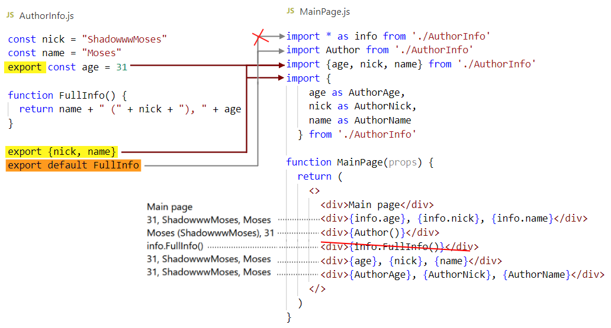
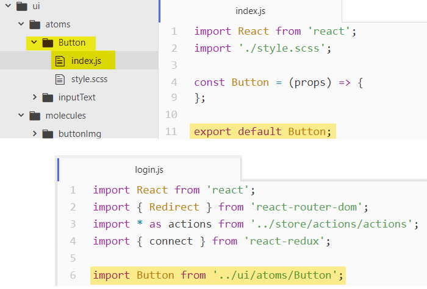

# import и export



* Экспортировать можно через `export` и `export default`

* Экспортировать можно сразу при объявлении или отдельно. Причем неважно, в каком месте файла это делать, можно и в начале

* Если что-то экспортируется отдельно, оно заключается в { }, будь то переменная или функция

* Все, что не экспортируется, не видно вне файла

  

* Импортировать можно все разом. Для этого указывается `*` и `as псевдоним` (as обязателен).

* Если как в примере, из файла есть одновременный обычный экспорт и default, то экспортированная как default не доступна через псевдоним - в примере info.FullInfo() не воспринимается как функция. То есть дефолтная штукая является самостоятельной и не видна в общем * экспорте

* Вещь, экспортированную через export default, можно импортировать под любым псевдонимом. Он пишется сразу и без скобок, как Author в примере

* Все, что экспортировано через обычный export, можно импортировать по исходным именам и при желании дать им другое имя


## Пути, import React from 'react'

► При импорте указывается относительный путь

> Как указывать абсолютный, внятного ответа я не нашел.

► Три основных вида пути:

```react
[1] import Main from './components/main/Main'
[2] import Ohter from '../other/Other'
[3] import React from 'react'
```

* `./` означает отсчет от текущей директории
* `../` переход в родительскую директорию
* Если не указано ни того, ни другого, это означает искать в `node_modules`

► Есть техника, когда вместо файла в импорте указывается папка. В этом случае в ней должен лежать файл `index.js` и вебпак поймет, что надо делать импорт из него:



Импортировать можно под любым удобным именем. То есть в этом примере можно было написать, например, `import SimpleButton`

►Для лучшей структуризации можно в папке сделать несколько файлов с компонентами, вложить их друг в друга, а в index.js оставить только это:

```react
export {default} from './about-page'
```


