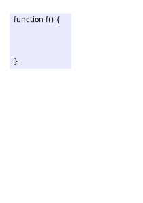

```javascript
let fruits = [];

fruits[-5] = 'apple';

console.log(fruits[-5]);
console.log(fruits.length);  // 0
```


```javascript
let fruits = [];

fruits[2] = 'apple';

console.log(fruits[2]);
console.log(fruits.length);  // 3
```


