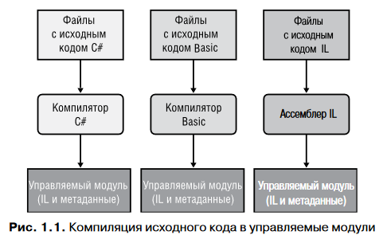
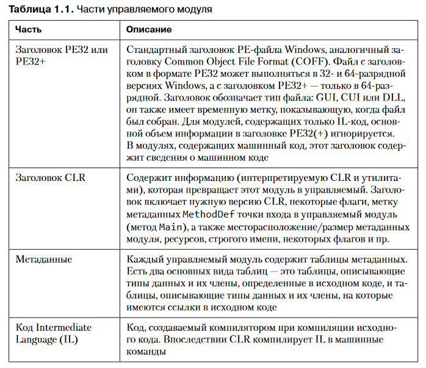
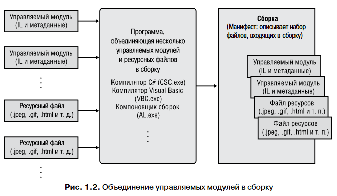

# CLR

Общеязыковая среда выполнения (Common Language Runtime, CLR)

Основные возможности CLR (управление памятью, загрузка сборок, безопасность, обработка исключений, синхронизация) доступны в любых языках программирования, использующих эту среду.

Например, при обработке ошибок среда выполнения опирается на исключения, а значит, во всех языках программирования, использующих эту среду выполнения, сообщения об ошибках передаются при помощи механизма исключений.

Разрабатывать программное обеспечение можно на любом языке программирования, если только используемый компилятор этого языка поддерживает CLR.

Исходный код программы может быть написан на любом языке, поддерживающем среду выполнения CLR. Затем соответствующий компилятор проверяет синтаксис и анализирует исходный код программы. Вне зависимости от компилятора результатом компиляции будет являться *управляемый модуль (managed module)* — стандартный переносимый исполняемый (portable executable, PE) файл, для выполнения которого на машине конечного пользователя должна быть установлена среда CLR.

> А если я dll компилирую, какой же тут исполняемый файл?

Языки программирования C#, Visual Basic, F# и IL-ассемблер всегда создают модули, содержащие управляемый код (IL) и управляемые данные (данные, поддерживающие сборку мусора). Однако, например, компилятор Microsoft C++ по умолчанию создает неуправляемый код, для выполнения которого CLR не требуется.

Компиляторы машинного кода производят код, ориентированный на конкретную процессорную архитектуру, а все CLR-совместимые компиляторы генерируют IL-код. IL-код называют управляемым кодом (managed code), потому что CLR управляет его выполнением.

Помимо генерирования IL-кода, компилятор создает полные метаданные (metadata) для каждого управляемого модуля. Это набор таблиц, описывающих то, что определено в самом модуле и на что он ссылается. Например, типы и их члены. Компилятор генерирует метаданные и IL-код одновременно, поэтому их рассинхронизация исключена. Они вместе привязываются к конечному управляемому модулю (например, EXE- или DLL-файлу) и разделить их нельзя.

# Сборка

CLR работает не с модулями, а со сборками.

Сборка (assembly) — это концептуальное понятие обозначает способ объединения группы файлов в единую сущность.  Она обеспечивает логическую группировку одного или нескольких управляемых модулей или файлов ресурсов. В контексте CLR сборку мы обычно называем компонентом.

 Манифест представляет собой обычный набор таблиц метаданных. Эти таблицы описывают файлы, которые входят в сборку, общедоступные экспортируемые типы, реализованные в файлах сборки, а также относящиеся к сборке файлы ресурсов или данных.

To be continued. Больше вопросов чем ответов дает этот раздел книги.