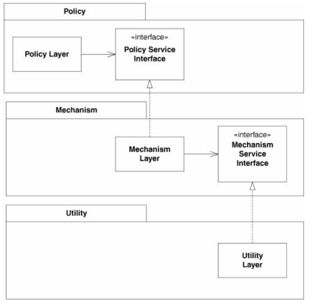

# Dependency Inversion Principle

**Принцип инверсии зависимостей:**

1. Модули высокого уровня не должны зависеть от модулей низкого уровня. Оба типа модулей должны зависеть от абстракций

2. Абстракции не должны зависеть от деталей. Детали должны зависеть от абстракций

► Возникают вопросы:

1. Чем определяется "высота" модуля? Что такое высокоуровневый модуль, а что - низкоуровневый?

2. Что такое абстракция, а что - деталь? И что тогда означает второй пункт?

**√ Вопрос 1.** "Высота" модулей в данном случае не обязательно определяется их позициями в многоуровневой архитектуре, а фактом, что одному модулю ("высокоуровневому") для выполнения своей работы требуется другой модуль ("низкоуровневый"). Хотя если брать уровень домена и инфраструктурный уровень, то здесь вроде высота совпадает с архитектурными уровнями. Но ведь даже в пределах одного уровня модули\классы могут пользоваться модулями\классами с того же уровня. Значит, кто-то из них концептуально выше, а кто-то - простой работяга.

Я могу представить себе это так: класс **Calculator** выполняет какие-то расчеты и хочет сохранить результат. При этом ему не важно, куда именно будет сохраняться результат - в файл, базу данных или еще куда-то. Важен сам факт, что результат должен быть сохранен. Сохранением может заниматься класс **Saver**. Можно написать несколько разновидностей класса Saver - TxtSaver, XMLSaver, MSSQLSaver - по одной для сохранения в каждый формат и передать любую реализацию Calculator'у, а он просто вызовет функцию сохранения, передав ей данные.

**√ Вопрос 2.** Таким образом, получается зависимость класса Calculator от класса Saver. Calculator является *клиентом* по отношению к Saver, поскольку он пользуется его возможностями. Calculator относится к уровню бизнес-логики, а Saver - к инфраструктурному уровню. Saver сам по себе является *абстракцией* - некоторой "сохранялкой", от которой Calculator'у требуется только функция сохранения, например, Save. TxtSaver и прочие - являются конкретными реализациями, содержащими специфический код для сохранения в конкретный формат, то есть *детали* сохранения. 

Получается, что абстракция Saver не зависит от деталей TxtSaver, XMLSaver, MSSQLServer, а наоборот - именно она диктует им условия - реализовать метод Save. То есть она определяет *интерфейс*, в данном случае состоящий из одного метода Save, который должна предоставлять каждая реализация этого интерфейса. Так и получается, что детали зависят от абстракции, а она от них - нет.

► Теперь возникают такие вопросы:

3. А где здесь инверсия-то?

4. Получается, DIP сводится к использованию интерфейсов вместо конкретных классов?

5. Если результатом работы Calculator является сложный объект, то в методе Save нужно тоже указывать для типа параметра какую-то абстракцию или можно конкретный класс?

**√ Вопрос 3.** У Боба Мартина написано:

> Зависимости следуют в направлении, противоположном направлению потока управления - именно поэтому принцип получил название принципа инверсии зависимостей

В итоге, если передавать конкретную реализацию, зависимость выглядит так: Calculator > XMLSaver. А если ввести интерфейс, то так: Calculator > ISaver < XMLSaver. То есть зависимость клиента от исполнителя никуда не исчезает, просто клиент становится независим от *конкретного* исполнителя. Ну а инверсию здесь можно усмотреть разве с той точки зрения, что в первом случае XMLSaver вообще ничего не знал о Calculator, а во втором он должен реализовывать интерфейс, который хочет от него Calculator. То есть XMLSaver начинает из-за этого интерфейса тоже зависеть от Calculator.

Цель Боб Мартина, когда он формулировал этот принцип, была придумать способ, который бы позволил повторно использовать высокоуровневые программные компоненты, заключающие в себе ключевую логику приложения.

Проблема же была в том, что в процедурном программировании было обычно так: есть самые простые процедуры, из них строятся более сложные, из них еще более сложные и так далее. То есть в итоге получалось, что каждый более высокий уровень был крепко завязан на уровень под собой. Изменения в низком уровне могли сломать верхний, причем эффект каскадный. А с введением интерфейса вопрос получается вроде бы решен.

**√ Вопрос 4.** Не совсем. Есть общее правило "Программируйте на основе интерфейсов, а не реализации", упомянутое еще в GoF. Но с DIP еще связано то, кто "владеет зависимостью", у Боба Мартина в "Agile, Principles, Patterns and Practices in C#" написано:

> Note that the inversion here is one of not only dependencies but also interface ownership. We often think of utility libraries as owning their own interfaces. But when DIP is applied, we find that the clients tend to own the abstract interfaces and that their servers derive from them.

То есть DIP подразумевает еще место хранения интерфейса - он хранится вместе с клиентским кодом. У Гэри Маклин Хола в книге "Адаптивный код" глава про DIP начинается с антипаттерна "Антураж" и паттерна "Лестница", где он вообще рекомендует хранить интерфейсы в отдельной сборке. Потому что если между сборками вот такая зависимость A > B > C, D то получается что A косвенно зависит от C и D и при компиляции в папку с A скопируется стаф C и D.  Вообще, перечитать надо этот момент в книге еще раз, потому что щас, глядя на картинку из книги Боба, проблему я перестал видеть.

