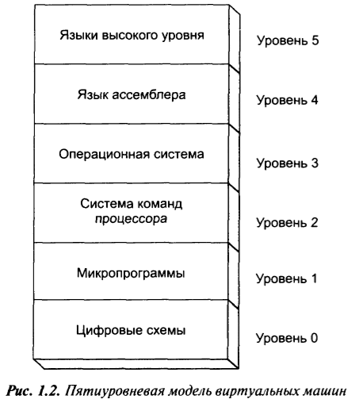
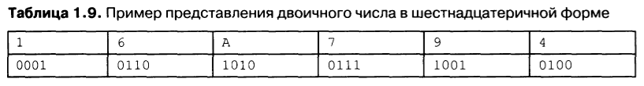

# Введение

Машинные команды имеют вид двоичных чисел, которые процессор может интерпретировать и выполнить действие.

Команды языка ассемблера соотносится с машинными командами один к одному. Просто они выглядят "по-человечески" за счет буквенного представления.

Программы на языке ассемблера не являются переносимыми. Поскольку каждая архитектура или семейство процессоров имеют собственный набор команд, который может отличаться, а ассемблер соотносится с ними один к одному, поэтому у них у всех - свой ассемблер.

Машинная команда - еще не самый низкий уровень, поскольку одна "простая" машинная команда, например, считывание значения из памяти в регистр процессора, может выполняться набором *микрокоманд*, которые производитель процессора может держать в тайне, потому что они относятся к *микроархитектуре*. То есть машинная команда относится к архитектуре и является общей для всех процессоров, использующих эту архитектуру, например, x86. А вот микроархитектура, то есть то, каким образом на физическом уровне реализована архитектура, является уникальной для каждого вида процессора. За счет разной микроархитектуры одни процессоры могут быть быстрее других, поэтому это и может являться тайной.

~~Для каждого из уровней существует транслятор, написанный на языке *этого же уровня*. Он способен "перевести" программу с более высокого языка на язык своего уровня. Например, операционная система, написанная на C, после компиляции приобретает вид в командах системы команд процессора. Операционная система сама по себе теперь является транслятором языка ассемблера в команды процессора. Язык высокого уровня транслируется в команды ассемблера, которые выполняет ОС.~~

Я в этом не уверен. Мне кажется очень вряд ли ОС что-то сможет сделать, получив текст программы на ассемблере. Наверняка нужно будет этот текст скомпилить, чтобы вместо `mov ax, bx` было какое-нибудь `0101010101010`. А когда происходит компиляция C-кода, там наверняка получается не код на ассемблере типа `mov ax, bx`, а сразу в двоичном виде машинный код.

# Термины

**Слово** 

> 2 байта, двойное слово 4 байта, четверное слово 8 байт.
>
> Технически, размер слова определяется по разрядности регистров процессора. 32х-разрядные регистры - значит слово 32 бита (4 байта). Но исторически словом называют два байта, видимо со времен, когда инженеры интел разработали 16-битный процессор и тогда же ввели в обиход термин "слово". После выхода 32х-битных процессоров термин остался старым.

**Старший и младший биты**

> Старший - слева, младший - справа

**Знаковое\беззнаковое**

> Если число знаковое, то старший бит используется для представления знака 1 значит -, 0 значит +

**Дополнительный код**

> Это специальный способ представления отрицательных целых чисел. Получается путем инвертирования всех битов положительного числа и прибавлением к нему единицы.
>
> 0000 1100 - +12
> 1111  0011 - инверсия
> 1111  0100 - инверсия + 1 = дополнительный код
>
> Зачем? Потому что сложение числа с самим собой, но в дополнительном коде, дает 0. Соответственно, при необходимости вычесть A - B, можно сделать A + (B доп код). Результат будет правильный, но вычитание можно будет реализовать командой сложения.
>
> 0000 1100 (+12)
> 1111  0100 (-12, доп код)
> 0000 0000 - сложение числа с самим собой в доп коде дает 0, потому что последняя единица теряется, уходя за пределы байта.
>
> Подробнее можно дочитать потом при необходимости.

# Продолжение

Двоичные числа в отладчиках для удобства представлены в 16ричном виде. Они разбиваются на фрагменты по 4 знака и заменяются 16ричным значением:

41h = 0100 0001 = 65

