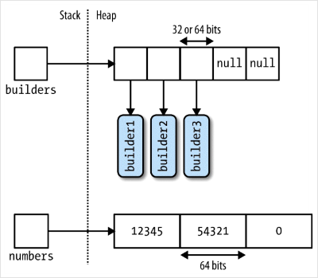

# Общая информация

► **Что такое массив и как он хранится в памяти? [72]**

Массив - это фиксированного размера набор переменных одного типа. Они хранятся в памяти непрерывным блоком и за счет этого возможен  произвольный доступ

► **Данные каких типов могут хранить массивы и на что это влияет? [326]**

Данными массива могут быть как value-type, таки и ссылочные типы. От  этого зависит, в каком виде они будут храниться в памяти. Вот схема:



Здесь builders - объекты, а numbers - обычные числа. И как видно, в  первом случае в массиве хранятся только ссылки на данные, а во втором -  сами данные.

► **Каким типом данных являются сами массивы и что из этого следует? [327]**

Сами массивы являются ссылочным типом, независимо от того, какие данные  они хранят. Из этого следует, что при обычном сравнении массивов  сравниваются не значения, а ссылки:

```c#
int[] a = { 1, 2, 3 };
int[] b = { 1, 2, 3 };
Console.WriteLine(a == b);  // false

int[] c = a;
Console.WriteLine(a == c);  // true
```

a == c не потому, что в массивах одинаковые данные, а потому что обе  ссылки указывают на одну и ту же область памяти. Причем с это даже не  самостоятельный массив, а просто ссылка на массив b.

► **Что будет, если не проинициализировать массив? [73]**

Элементы автоматически проинициализуются значениями по умолчанию для их типа:

```c#
var arr = new int[5];  // 0, 0, 0, 0, 0
```

Автоматическая инициализация работает и в случае более сложных элементов:

```c#
struct Point
{
    public int x;
    public int y;
}

var arr = new Point[5];  // 5 точек, у которых x и y будут 0
```

Если бы Point был классом, элементы массива содержали бы null

► **Можно ли изменить размер массива? [73]**

Изменить размер массива после создания невозможно.

► **В какой момент осуществляется проверка допустимости  индекса массива? Что будет, если обратиться по индексу за пределами  реального размера массива? [76]**

Проверка осуществляется в рантайме, в момент попытки обратиться к индексу. Если такого индекса нет, генерируется исключение *IndexOutOfRangeException*

```c#
int[] arr = { 1, 2, 3 };
arr[5] = 10;  // Ошибка возникнет только в рантайме
```


# Виды массивов

## Ранг и длина

**Ранг** - это количество измерений массива. Есть два метода для определения длины - `Length` для общего числа элементов во всем массиве и  `GetLength(измерение)` для количества элементов в указанном измерении. 

Всего  есть три вида массивов, у них поведение всех этих методов отличается.

## Одномерный

```javascript
int[] arr = { 5, 7, 3, 4, 12 };
var arr = new int[] { 5, 7, 3, 4, 12 };
// если явно указано количество элементов,
// инициализатор должен содержать ровно это количество
var arr = new int[5] { 1, 2, 3, 4, 5 };

arr.Length;  // 5
arr.Rank;  // 1
arr.GetLength(0);  // 5
arr.GetLength(1);  // Ошибка
```

## Зубчатый («массив массивов»)

```c#
int[][] arr =
{
    new int[] { 5, 7, 3 },
    new int[] { 4, 12 }
};

var arr = new int[2][]  // во вторых скобках ничего указыать нельзя
{
    new int[] { 5, 7, 3 },
    new int[] { 4, 12 }
};

arr.Length;  // 2
// по сути это все еще одномерный массив, просто содержащий другие массивы
// так что ранг все еще 1
arr.Rank;  // 1
arr.GetLength(0);  // 2
arr.GetLength(1);  // Ошибка
```

## Квадратный («матрица»)

```c#
int[,] arr =
{
    { 5, 7, 8 },
    { 6, 3, 1}
};

var arr = new int[2, 3]  // строка, столбец
{
    { 5, 7, 8 },
    { 6, 3, 1}
};

arr.Length;  // 6
arr.Rank;  // 2 - теперь измерений уже 2
// и поэтому работает длина для второго измерения тоже
arr.GetLength(0);  // 2 строк
arr.GetLength(1);  // 3 столбцов
```


# Поиск в массиве

Поиск осуществляется через статик методы класса Array.

У методов куча перегрузок, так что перечислю здесь только названия, а параметры можно посмотреть и в IDE.

## По конкретному значению

**IndexOf**, **LastIndexOf** - индекс первого/последнего совпавшего элемента.

```c#
int[] arr = { 5, 7, 3, 4, 12, 4 };
Array.IndexOf(arr, 4); // 3
Array.IndexOf(arr, 8); // -1 когда элемент не найден
Array.LastIndexOf(arr, 4); // 5
```

## По предикату

**Find**, **FindLast** - возвращает первый/последний подходящий элемент

**FindIndex**, **FindLastIndex** - возвращает *индекс* первого/последнего подходящего элемента

**Exists** - возвращает true/false если подходящий элемент есть/нет (аналог Linq .Any)

```c#
// Можно использовать как лямбду, так и bool-метод
static bool GreatherThen10(int num)
{
    return num > 10;
}

// Или предикат
Predicate<int> GreatherThan10Pred = x => x > 10;

int[] arr = { 5, 7, 3, 4, 12, 4 };
Console.WriteLine(Array.Find(arr, x => x > 10));  // 12
Console.WriteLine(Array.Find(arr, GreatherThen10));  // 12
Console.WriteLine(Array.FindIndex(arr, GreatherThan10Pred));  // 4
```

**FindAll** - возвращает *массив* всех подходящих элементов

```c#
int[] arr = { 5, 7, 3, 4, 12, 4 };
var odds = Array.FindAll(arr, x => x % 2 == 0);  // 4, 12, 4
```

Похож на операцию Linq .Where, но только возвращает массив, а не IEnumerable<T>

**TrueForAll** - возвращает true/false если все элементы массива удовлетворяют предикату (аналог Linq .All)

```c#
int[] arr = { 5, 7, 3, 4, 12, 4 };
Console.WriteLine(Array.Exists(arr, x => x == 0));  // false
Console.WriteLine(arr.Any(x => x == 0));  // false

Console.WriteLine(Array.TrueForAll(arr, x => x < 15));  // true
Console.WriteLine(arr.All(x => x < 15));  // true
```


# Операции с массивами

## Сравнение

Реальное сравнение проводится специальным методом:

```c#
int[] a = { 1, 2, 3 };
int[] b = { 1, 2, 3 };
a.SequenceEqual(b);  // true
```

## Копирование

Методом `.Clone()`. Стоит помнить, что при этом выполняется *поверхностное* копирование. То есть, если данные массива - объекты, то будут  скопированы ссылки на них, а не сами объекты. И получится два массива,  разделяющие одни и те же данные. Чтобы выполнить *глубокую* копию, нужно в цикле пройти по всем элементам и клонировать их персонально.