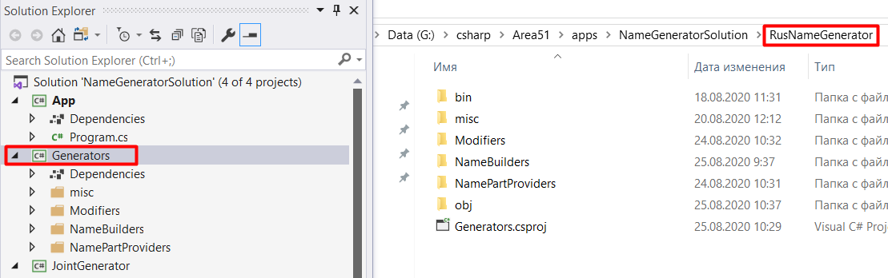
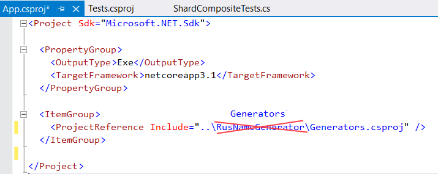

# Переименование сборок

► При переименовании сборки в VS названия самих папок в каталоге с программой не изменяются:

Если потом просто переименовать папку, программа перестанет компилироваться, так как у нее собьются все пути до сборки.

► Итак, что делать, если хочется не просто переименовать сборку, но и добиться соответствия в файловой системе проекта:

* Переименовать саму сборку (ПКМ по ней `> Rename`)

* Выгрузить сборку из решения (ПКМ `> Unload Project`)

* Удалить сборку из решения (ПКМ `> Remove`)

* Переименовать папку в проводнике

* Добавить сборку обратно в проект (ПКМ по *солюшену* `> Add > Existing Project...`, зайти в папку со сборкой и найти там файл .csproj)

* В файлах проекта всех зависимых сборок поменять название папки на новое. Для этого двойной ЛКМ  по сборке, откроется ее .csproj файл и там надо поменять путь на новый:

  

* Сделать ребилд приложения или только зависимых сборок

# Удаление сборок

При удалении сборки из решения она удаляется только из решения, а на диске остается.