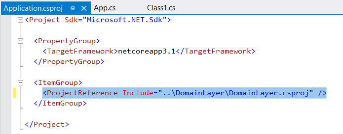

# Как формируется структура каталога с программой

## Создание решения

При создании пустого решения `StructureSolution` на диске появляется папка StructureSolution, а в ней файл StructureSolution.sln

## Добавление проекта в решение

Добавляем в решение новый проект-библиотеку, называем `Interfaces`. Тогда в решении появляется сборка Interfaces, а на диске в папке решения тоже папка Interfaces.

## Добавление папок в решение

Добавляем *в решение* папку `Domain`, при этом на диске такая папка не создается - не потому что в ней нет ни одной сборки, а потому что папки, добавляемые именно *в решение* вообще на диске никак не фигурируют и *в образовании неймспейсов не участвуют*, поэтому их можно переименовывать и ни на что это не повлияет. В папки можно добавлять подпапки и так далее - все одно и то же. К образованию физической папки на диске ведет только добавление сборки.

Если попробовать добавить сейчас в эту папку Domain сборку тоже с именем Domain, студия не даст этого сделать, из-за дублирования имен.

Поэтому добавим эту новую сборку под именем `DomainLayer`. Она появится *на диске на одном уровне с Interfaces*.

## Добавление папок в сборку

Добавим папку `Entities` *в сборку DomainLayer*. Эта папка также появится и *на диске*, в папке DomainLayer. Эта папка уже участвует в формировании неймспейсов - если в нее добавить класс Person, то у него будет неймспейс `DomainLayer.Entities`. Но можно руками исправить неймспейс на другой при желании.

## Циклические ссылки

Если сборка A ссылается на сборку B, то сборка B не может ссылаться на A. Организовать такую ссылку студия не даст.

Не даст она создать цикл и через косвенную ссылку, если попробовать сделать связь A→B→C→A


# Переименования

Добавим в решение сборку `Application` и сделаем ей ссылку на сборку DomainLayer.

Двойной ЛКМ по сборке, чтобы открыть ее проект-файл:



Видим, где указаны зависимости

## Переименование сборки

Переименуем сборку DomainLayer в DomainLayerNew. После этого приложение будет нормально билдится, никаких ошибок не возникнет, хотя во всех местах в программе сборка подключается под старым именем - `using DomainLayer`, `using DomainLayer.Entities`

Но в проект-файле Application, который ссылается на переименованную сборку, строка с зависимостью автоматически изменится:

```xml
<ItemGroup>
    <ProjectReference Include="..\DomainLayer\DomainLayerNew.csproj" />
</ItemGroup>
```

При этом на диске папка сборки останется под старым именем - DomainLayer и это же имя папки мы видим в проект-файле Application.

Получается путаница - сборка вроде называется DomainLayerNew, а неймспейсы подключаются как DomainLayer и в проект-файлах зависимых сборок разом как бы два имени

В общей сложности, имя сборки задействовано в:

* Имени сборки в студии
* Имени папки, в которой сборка лежит на диске
* Имени проект-файла сборки на диске

* Неймспейсах в самой сборке
* В using'ах в зависимых сборок
* В проект-файлах зависимых сборок

► Чтобы наладить одинаковое имя сборки и в решении, и на диске, надо:

* Переименовать DomainLayer в DomainLayerNew во всем решении через Ctrl+F, там есть опция

* Сохранить изменения во всех файлах через Save All (+далее делать Save All после каждого шага и всегда соглашаться на все изменения, если студия спрашивает)

* Переименовать сборку в студии

​		В этот момент у всех зависимых сборок автоматически слетают галочки с измененной сборки

* Выгрузить ее из решения

* Удалить ее из решения

* Выйти из студии, переименовать папку

* Зайти в студию, добавить сборку заново

* Все должно быть ок


# Неймспейсы

Неймспейс не виден, пока в нем нет хотя бы одного публичного типа