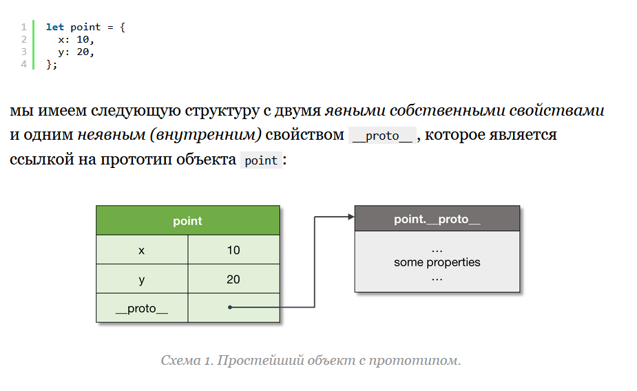
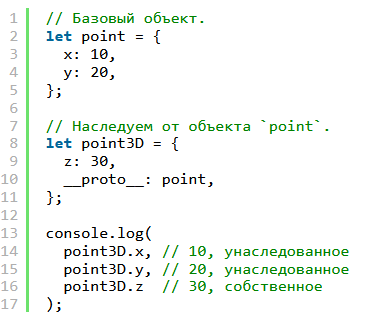
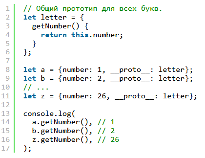
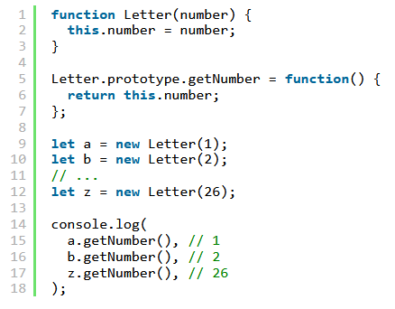
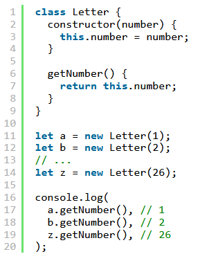
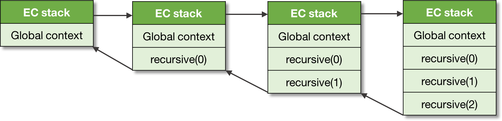
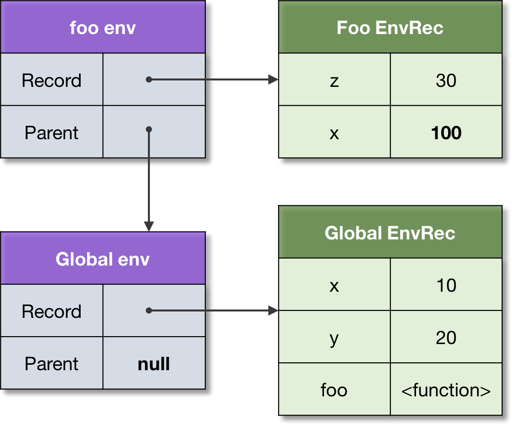
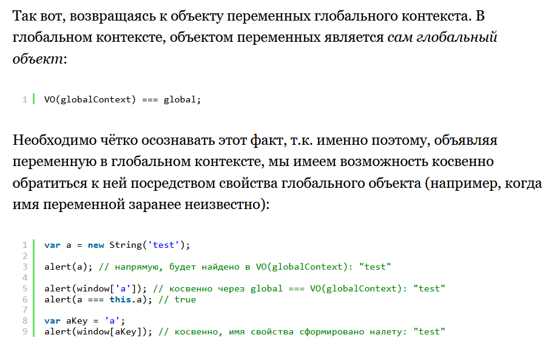

Выжимка из статьи Дмитрия Сошникова "Ecmascript Ядро 2-е издание". 

Так сказать, 1 level - из подробностей только самый минимум, чтобы понимать практику.


ECMAScript — это *объектно-ориентированный* язык программирования с *прототипной* организацией, имеющий концепцию *объекта* в качестве базовой абстракции.


Рассмотренные вопросы:

Прототипы, Классы, Контекст Исполнения, Лексическое Окружение, Замыкания, Проблема Фунарга


# Прототипы

**Определение 1:** ***Объект\*** — это *коллекция свойств*, имеющая также связанный с ней *объект-прототип*. Прототипом может быть также другой объект, или же значение `null`.

На свой прототип объект ссылается посредством внутреннего свойства `[[Prototype]]`, которое доступно в пользовательском коде через свойство `__proto__` (играет роль геттера\сеттера для [[Prototype]]).



Поскольку прототип - тоже объект, то и у него может быть прототип. Таким образом получается цепочка прототипов. Важное правило - во-первых, в качестве прототипа может быть установлен только объект (все другие типы игнорируются), во-вторых - не может быть циклических ссылок, т.е. A < B < C < A

Процесс поиска значений свойств называется **динамической диспетчеризацией** или **делегацией**. Динамическая она потому что происходит в рантайме. Работает по следующему принципу: если свойство не найдено в объекте, оно начинает искаться по цепочке прототипов, пока не найдется. А если не найдется, возвращается undefined.

Любой объект может быть прототипом другого объекта:



Можно задавать объекту другой прототип в рантайме.

Если при создании объекта прототип не задан явно, то им становится объект Object.prototype (а него в свою очередь прототип равен null). Чтобы прототипа не было вообще, это нужно явно сделать через `let obj = Object.create(null);`

Хотя свойство __proto__ доступно для использования напрямую, рекомендуется проводить все манипуляции с прототипами с помощью специальных методов  `Object.create`, `Object.getPrototypeOf`, `Object.setPrototypeOf`, и схожих в модуле `Reflect`.


# Классы

► Если брать полностью ручной способ формирования объекта, наследующего от другого объекта, то это выглядело бы так:



► До введения синтаксиса классов программисты могли писать так, чтобы немного уйти от такой прямолинейности:



Синтаксис функции-конструктора и ее назначение мне уже известен. Свойство prototype функции - это не прототип самой функции, а просто обычное свойство, в которое можно положить какой-нибудь объект,  и потом функция будет устанавливать его в качестве прототипа всем объектам, которые она создает. 

Потом это свойство prototype функции можно изменить на другое значение и все создаваемые объекты будут получать уже новый прототип, а на старых объектах это изменение никак не отразится - их прототипы останутся прежними.


► Синтаксис класса в JS - это сахар, который упрощает этот процесс, делая его нагляднее.

Технически “класс” представляет собой пару *“функция-конструктор + прототип”*. При этом, функция-конструктор *создает объекты*, а также *автоматически* устанавливает *прототип* для вновь созданных объектов.




# Контекст исполнения

***Контекст исполнения\*** — это абстрактное понятие, используемое спецификацией ECMAScript для типизации и *разграничения исполняемого кода*. Как конкретно технически будет реализован КИ зависит от движка, исполняющего JS-код.

Логически контексты исполнения формируются в *стек* (*стек контекстов исполнения*, как мы увидим ниже), который соответствует общему понятию *стека вызовов (call-stack)*.

Существует несколько типов исполняемого кода ECMAScript: *глобальный код*, *код функции*, *eval код* и *код модуля*; каждый код запускается в своем контексте исполнения.

Глобальный код - это код самого js-скрипта и inline-кода (помещенного в теги <script></script>). Он не включает в себя код, находящийся в телах функций.  *Глобальный объект (Global object)* — объект, который создаётся *до* входа в любой из контекстов исполнения. Данный объект существует в  единственном экземпляре, свойства его доступны из любого места  программы, жизненный цикл объекта завершается с завершением программы.


Код функции, соответственно, это код, находящийся в функциях, причем если в них вложены другие функции, то код вложенных функций не относится к коду объемлющей.

При вызове функции создается *новый контекст исполнения* и *добавляется (push)* в стек — в этот момент он становится *активным контекстом*. При возврате из функции контекст *удаляется (pop)* из стека. *глобальный контекст* находится всегда первым элементом в стеке;  он создается до выполнения любого другого кода и существует до конца  выполнения программы.



Контекст, который вызывает другой контекст, называется *вызывающим (caller)*. Соответственно, контекст, который вызывали, называется *вызванным (callee)*.

Контекст исполнения содержит два поля:

```javascript
activeExecutionContext = {
  VO: {...},
  this: thisValue
};
```

ссылку на VariableObject, объект переменных, и this - ссылку на ... ? на что? это мы еще узнаем


# Объект переменных

Отбой, объект переменных как концепция больше не существует. Его место заняли лексические окружения.


# Лексическое окружение

Каждый контекст исполнения имеет ассоциированное с ним *лексическое окружение (lexical environment)*.

***Лексическое окружение\*** — это структура, используемая для ассоциации *идентификаторов*, появляющихся в контексте, с их значениями. Каждое лексическое окружение также может иметь ссылку на *родительское окружение*.

> К слову, похоже это действительно именно какая-то структура данных специальная, а не просто объект, как я думал раньше. Потому что дальше у Дмитрия написано:
>
> "...Это в основном исторические причины ECMAScript, когда лексические окружения были представлены *обычными объектами*."

Или, проще говоря, это *хранилище* переменных, функций, (и классов?), объявленных в области видимости данного контекста.

Технически лексическое окружение представляет собой *пару*, состоящую из *записи окружения* (непосредственное хранилище-таблица, ассоциирующая идентификаторы с их  значениями), а также ссылка на родительское окружение (которая может  быть `null`).

Для кода:

```javascript
let x = 10;
let y = 20;
 
function foo(z) {
  let x = 100;
  return x + y + z;
}
 
foo(30); // 150
```

Структуры окружений *глобального контекста* и контекста функции `foo` будут выглядеть следующим образом:



Если переменная *не найдена* в *родном* окружении, осуществляется попытка найти ее в *родительском окружении*, в родителе родителя, и т.д. — до тех, пока вся *цепь окружений* не будет рассмотрена. Неразрешенный идентификатор выбрасывает исключение `ReferenceError`

> У меня возник вопрос, точно ли параметр z лежит в окружении? Я написал демку, проверил и да, он действительно там хранится со своим значением как и обычная переменная. Это же подтвердила и более старая статья Дмитрия Сошникова про Объекты переменных, которые были раньше, до Лексических окружений

??? Есть тут такой вопрос: вот фрагмент старой статьи:



Интересно, а с приходом лексических окружений, данные глобального объекта все еще хранятся непосредственно в нем самом?


# Замыкания

Функции в ECMAScript являются *объектами первого класса (first-class objects)*.

***Функция первого класса*** — функция, которая может быть  использованна в качестве обычных данных: т.е. сохранена в переменную,  передана в качестве аргумента, или возвращена в качестве значения из  другой функции.

С понятием функций первого класса связана так называемая **Фунарг проблема** (или *“Проблема функционального аргумента”*). Проблема возникает, когда функция использует *свободные переменные*. (называется фунарг, от сокращения имени параметра `function hello(funArg)`, т.е. когда значением параметра является функция)

***Свободная переменная*** — переменная, не являющаяся *ни параметром*, *ни локальной переменной* данной функции. Ну то есть какая-то внешняя по отношению к функции переменная.

► Проблема фунарга бывает двух типов:

**Нисходящая**:

```javascript
let x = 10;
 
function foo() {
  console.log(x);
}
 
function bar(funArg) {
  let x = 20;
  funArg(); // 10, но не 20!
}
 
// Передаем `foo` в качестве аргумента в `bar`.
bar(foo);
```

Т.е. *неоднозначность*, возникающая при определении *правильного лексического окружения* свободной переменной: должно ли это быть окружение *времени создания*, или же окружение *времени вызова*?

Данная проблема решена соглашением использования *статической области видимости (static scope)*, т.е. окружения *времени создания*. Или она еще называется *лексической областью видимости (lexical scope)*, отсюда и название *лексических окружений*.


***Замыкание\*** — это функция, *захватывающая лексическое окружение* того контекста, где она *создана*. В дальнейшем это окружение используется для *разрешения идентификаторов*.


**Восходящая**: когда захваченное окружение *переживает* порождающий ее контекст:

```javascript
function foo() {
  let x = 10;
 
  // Замыкание, захватываем окружение `foo`.
  function bar() {
    return x;
  }
 
  // Восходящий фунарг.
  return bar;
}
 
let x = 20;
 
// Вызов `foo` возвращает замыкание `bar`.
let bar = foo();
 
bar(); // 10, но не 20!
```


Вот еще пример - здесь две возвращенные функции разделяют одинаковое лексическое окружение:

```javascript
function createCounter() {
  let count = 0;
 
  return {
    increment() { count++; return count; },
    decrement() { count--; return count; },
  };
}
 
let counter = createCounter();
 
console.log(
  counter.increment(), // 1
  counter.decrement(), // 0
  counter.increment(), // 1
);
```


# This

Значением `this` является специальный объект, который *динамически* и *неявно* передается в код контекста исполнения. Мы можем рассматривать его как *неявный дополнительный параметр*, к которому мы имеем доступ, но который не можем изменять.

Нужно читать дополнительную статью http://dmitrysoshnikov.com/ecmascript/ru-chapter-3-this/#dopolnitelnaya-literatura

 

## 1 попытка

Короче, у Кантора написано на самом деле понятно и доступно и достаточно для понимания. А у Сошникова хоть и дофига, но ясности как-то не добавило. Зато после его объяснений мне канторовские просто стали кристально чистыми:

Допустим, в некоторой функции используется this. Значение this для нее вычисляет caller - вызывающий ее код. Как он его вычислит, зависит от того, как именно вызвана функция.

Пусть у нас есть такой объект:

```javascript
let user = {
  name: "Джон",
  hi() { alert(this.name); },
  bye() { alert("Пока"); }
};
```

Попробуем вызвать метод `hi` несколькими способами:

```javascript
[1] user.hi();
[2] user['hi']();
[3] (user.name == "Джон" ? user.hi : user.bye)();
[4] let hi = user.hi;
    hi();
```

Первые два способа сработают, а 3 и 4 нет.

Почему? В командах `user.hi()` и `user['hi']()` кроется две операции:

1. Получение значения свойства `hi` объекта `user` 
2. Попытка "выполнить" это значение

И самым важным является то, что эти две операции *не разделены*, а идут сразу друг за другом. Потому что типом значения `user.hi` является специальный *внутренний тип* `ReferenceType`, недоступный для программиста, а только для движка. Вызов этого типа приводит к тому, что вызываемый код - callee - получает ссылку на объект и на метод этого объекта.

> ```
> (base, name, strict) - вот три значения, передаваемые вызываемому коду.
> В данном примере это будут (user, "hi", true) - то есть `объект`, на котором нужно вызвать `метод` и в каком `режиме` выполняется код (строгий true, обычный false)
> ```

Но в случае, когда эти две операции разделены, как например в строках 3 и 4, то значение из ReferenceType преобразуется в другой тип - непосредственно в функцию. И при вызове она значений не получает и выполняется как обычная функция, не имеющая отношения к объекту.


Не, хуйня!

Еще раз почитал у Сошникова, там что-то про идентификаторы есть и как получается ReferenceType вообще. У переменных тоже вроде ReferenceType, только вот base другой, поэтому и this другой. Надо бы еще чекнуть. Там есть точечная нотация, скобочная тоже.


Короче говоря, некст трай:

## 2 попытка

Значение this надо рассматривать в отношении двух видов кода: глобального и кода функции.

## В глобальном коде

this в глобальном коде указывает на глобальный объект, если режим обычный. Если режим строгий, то this равно undefined.