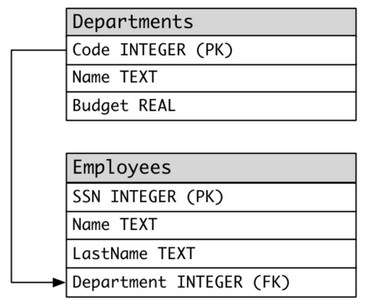

► Выбрать производителей с названиями и ценой их самого дорогого товара:

```sql
select m.name, p.name, p.price
from products as p, manufacturers as m
where p.manufacturer = m.code
	and p.price = (
		select max(price)
		from products
		where manufacturer = p.manufacturer)
```

> Просидел 15 минут и так и не решил. Посмотрел решение и удивился, почему не догадался. Вроде бы обычный подзапрос с использованием данных из внешнего запроса




► Выбрать отделы, в которых работают больше двух сотрудников:

Самое очевидное, что пришло в голову. Соединение, группировка:

```sql
select d.name
from departments as d, employees as e
where d.code = e.department
group by d.name
having count(d.name) > 2
```

Альтернатива без соединения:

```sql
select name
from departments
where code in (
	select department
	from employees
	group by department
	having count(*) > 2
)
```

И вот самый интересный для меня вариант - подзапрос безо всяких группировок, а через передачу текущего отдела из внешнего запроса:

```sql
select d.name
from departments as d
where 
   (select count(*)
	from employees
	where department = d.code) > 2
```


► Выбрать сотрудников отделов, в которых второй по величине бюджет с конца (выбрать, короче говоря, сотрудников *почти* самых бедных отделов):

```sql
select e.name, e.lastname, d.name
from employees as e, departments as d
where e.department = d.code 
	and d.budget = (
		select top 1 budget
		from (
			select distinct top 2 code, budget
			from departments
			order by budget) as lowest
		order by budget desc
	)
```

> Не догадался поставить во внутреннем подзапросе distinct, а без него, если например будет 2 самых бедных отдела, то *почти* самый бедный не попадет в выборку