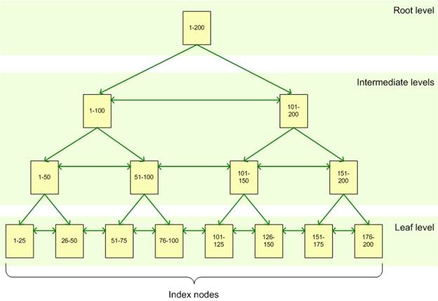
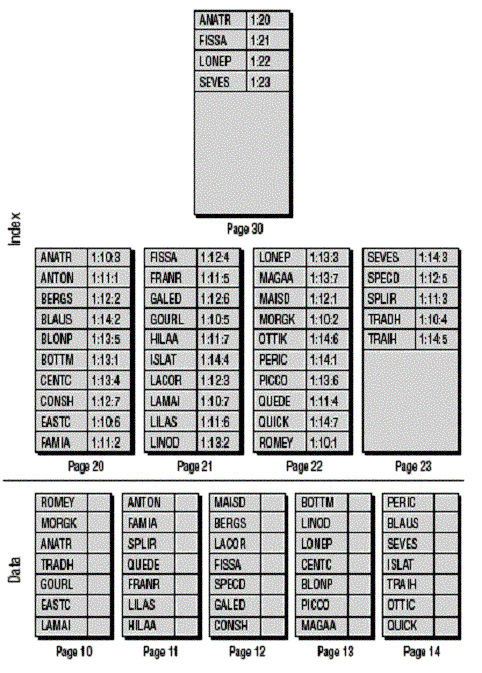
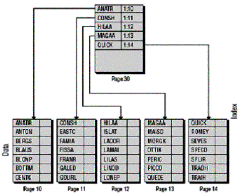
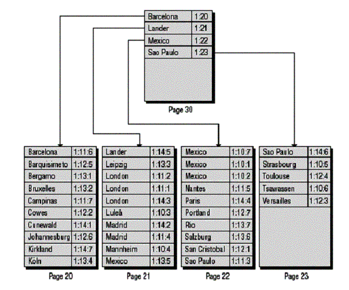

# Об индексах

Данные в таблицах хранятся в виде неупорядоченной кучи и чтобы найти нужные данные, SQL Server должен просмотреть все их по порядку. Данные хранятся на страницах по 8кб.

Так происходит, пока для таблицы не создается индекс. Его можно создать самому, либо он создается автоматически, когда для таблицы определяется первичный ключ. Он представляет собой набор данных, хранящийся на диске отдельно. Организован он в виде сбалансированного дерева (B-tree), поэтому поиск в нем осуществляется гораздо быстрее, чем при просмотре всех записей. Например, при поиске значения 123 надо просмотреть всего 4 страницы:

Таким образом, если поиск осуществляется по индексированному столбцу, сервер сначала ищет индекс, а потом по нему уже быстро находит всю строку в куче данных. Второй столбец здесь называется rowID:

В теории индексы замедляют операции вставки, удаления и обновления, потому что кроме модификации самих данных, приходится еще модифицировать индексы. На практике алгоритмы работы с индексами стараются свести эти издержки к минимуму.

Индексы можно создать на любой столбец, кроме тех, которые хранят большие объекты типа image, text, varchar(max).

# Кластерный и некластерный индексы

В листьях индекса могут храниться либо непосредственно данные, либо ссылки на них. Этот факт делит индексы на два типа.

## Кластерный

Если хранятся сами данные, то это - *кластерный индекс*.

По этой причине у таблицы может быть только один кластерный индекс - ведь данные и есть данные, они одни, непосредственно сами. Они хранятся в отсортированном виде - либо по возрастанию, либо по убыванию:

## Некластерный

Если хранятся только ссылки на данные - это *некластерный индекс*.

# Список литературы

[SQR ru](https://www.sql.ru/articles/mssql/03013101indexes.shtml#3)

[Хабр](https://habr.com/ru/post/247373/)