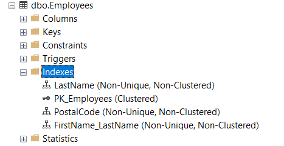

# Об индексах

> Индекс - это средство, обеспечивающее быстрый доступ к строкам таблицы на основе значений одного или нескольких столбцов

Для СУБД индекс - как предметный указатель для человека в книге. Индекс занимает отдельное место на диске и содержит данные плюс указатели на страницы и строки, где эти данные встречаются. Сами данные хранятся в виде страниц одинакового размера (например, 8кб) и обычно не упорядочены.

Индексы могут иметь разные реализации. Например, в виде сбалансированного дерева (B-tree), где значения столбцов хранятся в отсортированном виде, поиск происходит быстро за счет двоичного поиска. Может быть хэш-индекс, где множество значений попадают в один и тот же блок из относительно небольшого количества записей.

Независимо от реализации, индекс надо формировать из столбцов, по которым наиболее часто производится поиск. СУБД в большинстве случаев автоматически создает индекс по столбцам первичного ключа, но можно добавлять дополнительные индексы по необходимости.

Пример индекса в виде сбалансированного дерева - при поиске значения 123 надо просмотреть всего 4 страницы:

Таким образом, если поиск осуществляется по индексированному столбцу, сервер сначала ищет индекс, а потом по нему уже быстро находит всю строку в куче данных:

В теории индексы замедляют операции вставки, удаления и обновления, потому что кроме модификации самих данных, приходится еще модифицировать индексы. На практике алгоритмы работы с индексами стараются свести эти издержки к минимуму.

Индексы можно создать на любой столбец, кроме тех, которые хранят большие объекты типа image, text, varchar(max).

# Кластерный и некластерный индексы

В листьях индекса могут храниться либо непосредственно данные, либо ссылки на них. Этот факт делит индексы на два типа.

## Кластерный

Если хранятся сами данные, то это - *кластерный индекс*.

По этой причине у таблицы может быть только один кластерный индекс - ведь данные и есть данные, они одни, непосредственно сами. Они хранятся в отсортированном виде - либо по возрастанию, либо по убыванию:

## Некластерный

Если хранятся только ссылки на данные - это *некластерный индекс*.

# Создание индекса

Какие у таблицы есть индексы можно посмотреть в SSMS:

Тут же можно их создать и удалить

# Список литературы

[SQR ru](https://www.sql.ru/articles/mssql/03013101indexes.shtml#3)

[Хабр](https://habr.com/ru/post/247373/)