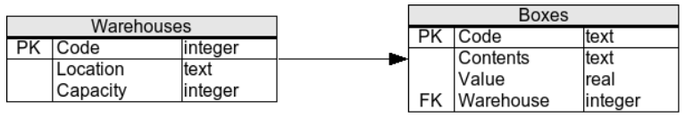

► Выбрать все данные о товарах, включая всю информацию об их производителе

```sql
select p.*, m.name
from products as p
	inner join manufacturers as m
		on p.manufacturer = m.code
```

```sql
select *
from products as p, manufacturers as m
where p.manufacturer = m.code
```

> Я добавил этот простой пример, чтобы не забывать о втором способе соединения таблиц - без join, а через условие в where


► Выбрать среднюю стоимость товаров каждого производителя, показывая имя производителя:

```sql
select m.name, avg(p.price)
from products as p, manufacturers as m
where p.manufacturer = m.code
group by m.name
```

> Косяк: решил попробовать группировать по m.code вместо имени


► Выбрать название и цену самого дешевого товара:

```sql
select name, price
from products
where price = (select min(price) from products)
```

> Косяк: пытался дать подзапросу псевдоним

Интересный альтернативный вариант. Не совсем корректный, если будет несколько товаров с минимальной ценой:

```sql
select top 1 name, price
from products
order by price
```




► Выбрать коды складов вместе с количеством коробок в них. Если на складе нет коробок, он должен попадать в выборку с цифрой 0:

```sql
select w.code, count(b.code)
from warehouses as w
	left join boxes as b
		on w.code = b.warehouse
group by w.code
```

> Сперва подумал, что надо делать через какие-нибудь условия вроде IIF и не подумал даже про left join поначалу


► Выбрать перегруженные склады (у которых фактическое количество коробок больше вместимости склада):

```sql
select w.code
from warehouses as w
where 
	w.capacity < (
	select count(code)
	from boxes
	where warehouse = w.code)
```

