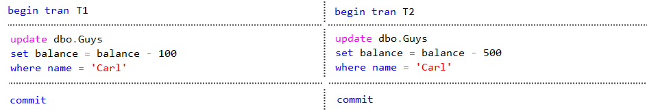

# Проблемы параллельных транзакций

Примеры будут разобраны на следующих данных:


## Пропавшее обновление (Lost Update)

### Проблема

> Заключается в том, что если две транзакции выполняют над одними и теми же строками свои обновления, то в итоге последнее обновление перезапишет собой работу первого.

У Карла было 2000 рублей. Две транзакции списывают со счета Карла плату за проезд (100) и за интернет (500). Из-за недостаточной согласованности транзакций, Т1 никак не учитывает работу Т2 и просто перезаписывает ее результат. В итоге у Карла остается 1900 рублей, хотя должно быть 1400:


► Здесь есть особенность. Данная проблема возможна только если данные предварительно считываются в переменную, как в примере выше. А вот в таком случае проблемы пропавшего обновления не бывает, за этим следит сервер:



### Решение

Для случая со считыванием в переменную решением будет уровень изоляции `Repeatable Read` и `Serializable`, поскольку они блокируют считанные записи и уже никто с ними ничего сделать не сможет до завершения считавшей транзакции.


## Грязное чтение (Dirty Read)

### Проблема

> Заключается в том, что при *чтении* видно изменения, которые еще окончательно не приняты. Поэтому, если эти изменения будут отклонены, получится что транзакция, выполнившая грязное чтение, опиралась на неправильные данные.

Например, первая транзакция делит пополам баланс всех пользователей. Выходит, что у Карла, Джерри и Тома баланс становится <= 1000. Вторая транзакция выбирает пользователей с балансом меньше 1000 и получает этих ребят. Потом первая транзакция делает откат и у Карла оказывается снова 2000, но Карл уже "попал", хотя его баланс на самом деле больше 1000:


Грязный select также  будет видеть вставленные и удаленные записи еще до коммита.

► Данная проблема касается только чтения - только select будет брать грязные данные. Если же попробовать сделать в этом же примере вместо select

```sql
update dbo.Guys
set blocked = 1
where balance <= 1000
```

или

```sql
delete from dbo.Guys
where balance <= 1000
```

то обе эти команды будут ждать завершения T1 независимо от своего уровня изоляции и в итоге обновятся\удалятся только Tom и Jerry, а Carl останется нетронутым. Недаром проблема называется именно "грязное чтение". А то грязно удалять например было бы совсем уж грязно)

► Однако опять же - если выбрать грязные данные в переменную, как было в примере с Lost Update, и потом обновлять\удалять на основании этой переменной, тогда Carl пострадает.

### Решение - Read Committed

Для транзакции T2 нужно установить уровень блокировки `read committed`

```sql
set transaction isolation level read committed
```

Тогда она перед выполнением чтения будет ждать, пока первая транзакция завершится.


## Неповторяющееся чтение (Non-repeatable Read)

### Проблема

> Заключается в том, что несколько чтений по одинаковым критериям в пределах одной транзакции выдают разные результаты.

Например, в транзакции T1 мы считываем строки, в которых имя начинается на T, получаем две строки. Где-то чуть позже параллельная транзакция Т2 удваивает баланс строкам, которые начинаются на T. Тогда при повторном чтении в T1 мы получим уже новый баланс:


Или похожий случай, только вторая транзакция не обновляет, а удаляет строки и тогда повторное чтение в T1 вообще не выдает ни одной строки:


### Решение - Repeatable Read

Для транзакции T1 нужно установить уровень изоляции `repeatable read`

```sql
set transaction isolation level repeatable read

begin tran T1
...
```

Тогда она будет накладывать блокировку *на строки, которые считала* и другая транзакция не сможет *эти строки* ни обновить, ни удалить.

Однако, вторая транзакция все еще может вставить новые строки, например, Teddy и Tyler, и тогда T1 во второй выборке получит 4 записи, а не две. Но это уже другая проблема - фантомное чтение.


## Фантомное чтение (Phantom Read)

### Проблема

> Возникает, когда в пределах одной транзакции последующая операция чтения возвращает *больше* строк, чем аналогичная предыдущая.

Например, транзакция выбирает всех пользователей, чье имя начинается на T, а потом другая транзакция вставляет новые записи тоже с именами на T. В итоге второе чтение в Т1 получит больше записей, чем первое:


### Решение - Serializable

Режим изоляции `Serializable`


# Таблица проблем и решений


# Дополнительно

## Сессия и транзакция

Сессия и транзакция - разные вещи. Сессия - это "контейнер", в рамках которого выполняются транзакции

## Виды блокировок

Блокировки бывают разных уровней:

* Уровня БД
* Уровня таблицы
* Уровня страницы
* Уровня строки.

В плане реализации, блокировка уровня БД самая простая, а уровня строки - самая сложная. Эффективность каждого типа зависит от задачи. Блокировка уровня БД хорошо подходит для запросов, изменяющих структуру БД. Если много пользователей разом работают с одной и той же таблицей, например, формируют какие-то заказы, то в этом случае подходит блокировка на уровне страниц.

## START TRANSACTION и SET TRANSACTION

START TRANSACTION *начинает новую транзакцию* с оп­ределенным набором свойств

SET TRANSACTION *ус­танавливает свойства* для *следующей транзакции*